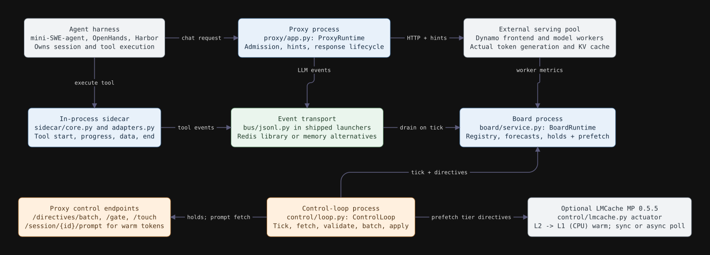

# ATFM

**Agent Traffic Flow Management for LLM serving.** Forecast when agents will return from tools, then use those forecasts to manage admission and cache-related actions on a shared serving pool.

[](pyproject.toml)
[](docs/status.md)
[](docs/README.md)

[Quickstart](#quickstart) · [Documentation](#documentation) · [Experiments](#experiments) · [Contributing](CONTRIBUTING.md) · [Issues](https://github.com/Alexander-Aghili/ATFM/issues)

Agents spend much of their time running tests, builds, and other tools. Their next LLM request is absent from the queue, but its cached context may still occupy GPU memory. ATFM combines session history, elapsed time, tool progress, and backend signals to predict those returns and evaluate whether acting early improves serving outcomes.

**Status:** research prototype with CPU simulation, trace evaluation, and local service integration. Real-GPU performance and production readiness are not established. See [implemented features and limitations](docs/status.md).

## Features

- **Demand forecasts:** history, survival, progress, and backend-aware models; Monte Carlo KV-block and prefill-token demand with calibration.
- **Request control:** OpenAI-compatible proxy, priority queues, bounded holds, admission windows, tool launch gates, [prediction overload protection](docs/operations.md#prediction-overload-protection), and [isolated board computation](docs/operations.md#board-computation-and-prediction-freshness).
- **Cache-aware actions:** budgeted touches and verified LMCache MP CPU warming; tier and replica recommendations have explicit integration limits.
- **Agent instrumentation:** tool sidecars, harness adapters, and JSONL, in-memory, or Redis Streams event transport.
- **Reproducible evaluation:** simulation, paired comparisons, CPU/load benchmarks, [constrained policy tuning](docs/development/policy-tuning.md), and optional Phoenix tracing.

## Quickstart

Requires **Python 3.12** and **uv**. The synthetic example needs no GPU, model server, Docker, or downloaded dataset.

```bash
git clone https://github.com/Alexander-Aghili/ATFM.git
cd ATFM
uv sync --extra dev
uv run python scripts/run_h2sim.py experiments/quickstart.yaml
```

Compares native scheduling, proxy rules, and forecast-based cache placement across three seeds. Results go to `runs/quickstart/`, including `metrics.csv` and paired comparisons. This is a functional example, not a hardware benchmark. Use a new experiment name to preserve previous outputs.

To run the tests:

```bash
uv run pytest -q
```

For local services, install `uv sync --extra dev --extra serve` and follow the [operations guide](docs/operations.md). The proxy exposes `/v1/chat/completions`; stable session IDs connect successive agent calls. Optional `harness` and `dynamo` extras support their respective integrations; external services need separate setup.

## Architecture



The **sidecar and proxy** emit events. The **board** reconstructs session state and predicts demand. **Controllers** combine forecasts with capacity observations and deliver supported actions. The upstream serving engine owns inference and actual KV tensors.

| Location | Responsibility |
| --- | --- |
| [`src/atfm/`](src/atfm) | Runtime, schemas, forecasting, control, simulation, and metrics |
| [`experiments/`](experiments/README.md) | Separate experiment package, configurations, benchmarks, and analytics |
| [`scripts/`](scripts) | Service and experiment entry points |
| [`tests/`](tests) | Unit contracts, integration, reference comparisons, and performance invariants |
| [`docs/`](docs/README.md) | Architecture, development, evidence, and research papers |

Explore all six diagrams, API routes, state ownership, and complexity notes in the [architecture guide](docs/architecture/03-code-and-documentation.md) or its [PDF](docs/architecture/atfm-architecture.pdf).

## Documentation

| Read | Purpose | PDF |
| --- | --- | --- |
| [Architecture](docs/architecture/03-code-and-documentation.md) | Code, runtime flows, testing, and documentation map | [Download](docs/architecture/atfm-architecture.pdf) |
| [ATFM research paper](docs/paper/README.md) | Hypotheses, algorithms, evaluation, and limitations | [Download](docs/paper/atfm-paper.pdf) |
| [LLM serving background](docs/paper/background/README.md) | KV caches, vLLM, LMCache, related systems, and motivation | [Download](docs/paper/background/llm-serving-background.pdf) |
| [GPU results and caching tradeoffs](docs/research/gpu-results-report/README.md) | Measured runs, capacity constraints, nine figures, and next experiments | [Download](docs/research/gpu-results-report/atfm-gpu-results-2026-09-29.pdf) |
| [Operations](docs/operations.md) | Start and configure the proxy, board, and control loop | — |
| [Core development](docs/development/core.md) | Module contracts and safe extension points | — |
| [Performance](docs/development/performance.md) | Scaling, bottlenecks, and the Python/Rust decision | — |
| [Research notes](docs/research/README.md) | Dated measurements and reproducible evidence | — |

See the [full documentation index](docs/README.md) for load testing, observability, design records, and publication build instructions.

## Experiments

```bash
# H1: forecast accuracy on a synthetic fleet
uv run python scripts/run_h1.py experiments/h1_synthetic.yaml

# H2: serving outcomes in a closed-loop simulation
uv run python scripts/run_h2sim.py experiments/h2sim_loaded_kv.yaml
```

H1 measures prediction quality; H2 measures policy effects under a simulated worker model. HTTP load tests measure runtime overhead with a fake worker. None substitutes for real-GPU validation.

The [experiment guide](experiments/guide.md) lists model and policy families, outputs, and interpretation. Use the [policy-tuning workflow](docs/development/policy-tuning.md) to evaluate settings on your workload and hardware, with constraints and independent validation. For the latest measured bottleneck work, see the [upstream transport study](docs/research/2026-09-28-sharded-transport.md). For scaling and diagnostics, see [CPU benchmarks](experiments/README.md#cpu-scaling-trials), [HTTP load testing](docs/development/load-testing.md), and [Phoenix tracing](docs/development/observability-tests.md). Corpora and run outputs live in ignored `data/` and `runs/` directories.

## Contributing

See [CONTRIBUTING.md](CONTRIBUTING.md) for setup, tests, reproducibility, and review expectations. Keep changes focused, preserve behavioral and performance contracts, and update the relevant documentation. Report bugs or propose improvements through [GitHub issues](https://github.com/Alexander-Aghili/ATFM/issues), including a minimal reproduction and environment details.

## License

A project-wide license has not yet been declared. Reproduced paper artwork retains its original attribution and licenses; see the [artwork manifest](docs/paper/background/figures/papers/manifest.json).

For CPU-only deployment preparation, run the [local Dynamo + AIPerf smoke](docs/development/local-cluster.md) with an existing AgentX trace before renting GPUs.

Before renting GPUs, run the [real GPU cache check](docs/development/gpu-cache.md).
The pinned vLLM/LMCache stack passed on an RTX 4060: [results and limits](docs/research/2026-09-28-gpu-cache.md).
The [H100 NVL follow-up](docs/research/2026-09-29-h100-cache.md) also passed cache reuse.
Use the [public tool-call and agentic workload recipe](docs/development/gpu-public-workloads.md)
for BFCL API samples and complete Weka sessions. See the [measured results and limits](docs/research/2026-09-29-public-gpu-workloads.md); these are distinct from policy-performance claims.
