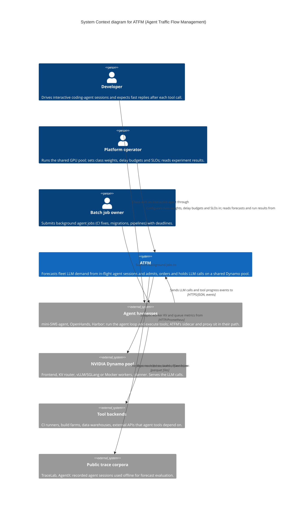

# Level 1 — System Context — ATFM

> **Diagram type**: System Context
> **Scope**: ATFM (Agent Traffic Flow Management) as one system, the people who depend on it, and the external systems it touches.
> **Audience**: everyone: founders, reviewers, platform operators, agent developers.
> **Status**: draft v1.1, generated from the architecture spec (2026-09-23); pending founder validation.

## Overview

ATFM is a control layer for fleets of LLM agents that share one GPU pool served by NVIDIA Dynamo. Agents alternate between short LLM calls and tool calls that run from milliseconds to hours. ATFM watches the live state of every in-flight session (which tool is running, how long it has run, what it reports), forecasts when sessions will next need the GPU and how much KV memory they will demand, and uses that to admit, order and, for deferrable background work, hold LLM calls. It sits between the agent harnesses and the Dynamo pool and never modifies what an agent sees.

Three kinds of people depend on it: developers driving interactive agents who want fast replies after each tool call, owners of background agent jobs who have deadlines and a delay budget, and the platform operator who runs the pool and sets the trade-offs. Recorded public trace corpora are used offline to evaluate the forecasts.

## Diagram

Rendered copy: [01-context.svg](./01-context.svg).

## Legend

- **Person / actor**: a human role that interacts with the system.
- **System (in scope)**: ATFM.
- **External system**: out-of-scope software ATFM depends on or acts upon.
- No colors, icons or line styles carry meaning in this diagram.

## Elements

| Element | Type | Technology | Responsibility |
|---|---|---|---|
| Developer | Person | — | Drives interactive coding-agent sessions; protected outcome is time to first token after a tool returns. |
| Batch job owner | Person | — | Submits background agent jobs with deadlines; accepts bounded delay in exchange for lower cost. |
| Platform operator | Person | — | Runs the shared pool; sets class weights, per-class delay budgets and SLOs; reads forecasts and experiment results. |
| ATFM | System | Python 3.12 services and libraries | Forecasts fleet demand from in-flight sessions; admits, orders and holds LLM calls; measures the cost of holding. |
| Agent harnesses | External system | mini-SWE-agent, OpenHands, Harbor | Run the agent loop and execute tools; host ATFM's sidecar and send LLM calls through ATFM's proxy. |
| NVIDIA Dynamo pool | External system | Dynamo v1.5 frontend, KV router, vLLM/SGLang or Mocker workers, planner | Serves the LLM calls; honours priority hints; exposes worker metrics. |
| Tool backends | External system | CI runners, build farms, data warehouses, external APIs | Where agent tools actually run; shared backends produce correlated slowdowns. |
| Public trace corpora | External system | TraceLab, AgentX (parquet after conversion) | Recorded sessions replayed offline to score forecasts and calibrate the simulator. |

## Key relationships

| From | To | Intent | Protocol / Technology |
|---|---|---|---|
| Developer | Agent harnesses | Chats with an interactive agent through | harness UI |
| Batch job owner | Agent harnesses | Submits background jobs to | harness batch runner |
| Platform operator | ATFM | Configures class weights, delay budgets and SLOs; reads forecasts and run results | YAML config, CLI |
| Agent harnesses | ATFM | Sends LLM calls and tool progress events to | HTTP/JSON (OpenAI API), event stream |
| ATFM | NVIDIA Dynamo pool | Forwards admitted LLM calls with priority hints to | HTTP/JSON with `nvext.agent_hints` |
| ATFM | NVIDIA Dynamo pool | Scrapes worker KV and queue metrics from | HTTP/Prometheus |
| Agent harnesses | Tool backends | Runs tools (tests, builds, queries) on | varies per tool |
| ATFM | Public trace corpora | Replays recorded sessions offline from | parquet files |

## Notable architectural decisions

- ATFM is additive: the request path gains exactly one hop (the proxy) and the result path of every tool is byte-for-byte unchanged (spec D9). Everything else runs beside the blocking path and fails open (D10).
- The central claim is split in three (D11): in-flight session state forecasts demand (H1a, evidence exists); live tool progress improves on elapsed time (H1b, only on long-tool workloads); a controller converts the forecast into lower latency or cost at a stated delay budget (H2, closed-loop runs only, D12).
- Dynamo is treated as an external system whose documented hints (`priority`, `strict_priority`, `osl`, `speculative_prefill`) are the only integration surface in v1; router plugins, worker selection and KV placement APIs are out of scope (D1, D3).

## Assumptions

- The platform operator is the same person or team that runs experiments; there is no separate end-user UI in v1.
- Tool backends are modelled only through their identifier and observed slowdowns; ATFM never calls them.
- Trace corpora are read from local parquet files after a one-time conversion; no live connection to their sources.

## Links to other levels

- ↓ [Container diagram](./02-container.md) — the deployable parts inside ATFM.
- See also: [architecture spec v1.1](../superpowers/specs/2026-09-22-atfm-architecture-design.md), [design page](./atfm-architecture.html).
