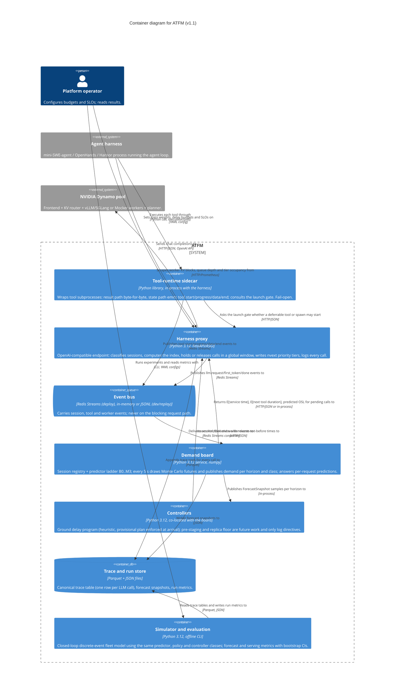

# Level 2 — Container — ATFM

> **Diagram type**: Container
> **Scope**: the independently deployable parts of ATFM and how they exchange data with each other, the agent harness and the Dynamo pool.
> **Audience**: the engineering team building and operating ATFM.
> **Status**: draft v1.1, generated from the architecture spec (2026-09-23); pending founder validation.

## Overview

ATFM has two paths. The request path is one hop: the harness's LLM calls go through the harness proxy, which decides when to release each call and with what priority tier, then forwards it to the Dynamo frontend unchanged apart from hints and headers. The state path is everything else: the sidecar inside the harness emits tool progress, the proxy emits call events, worker metrics are scraped, and the event bus carries all of it to the demand board, which publishes forecasts that the controllers turn into hold directives back to the proxy. Nothing on the state path can block a request.

The simulator and evaluation tools are offline programs that reuse the same predictor, policy and controller classes against a closed-loop fleet model, so a simulated run and a real run write identical trace tables and metrics.

## Diagram

Rendered copy: [02-container.svg](./02-container.svg).

## Legend

- **Container**: an independently deployable process, library loaded into another process, or data store.
- **Queue container**: the event bus.
- **Database container**: file-based trace and run store.
- **External system**: the agent harness and the Dynamo pool (out of scope).
- No colors, icons or line styles carry meaning in this diagram.

## Elements

| Element | Type | Technology | Responsibility |
|---|---|---|---|
| Tool-runtime sidecar | Container (library, in-process with the harness) | Python 3.12 | Wraps every tool subprocess; returns output byte-for-byte; streams the same output through parsers (pytest, build, dbt, training, fallback) that emit progress and data events; consults the launch gate for deferrable tools and spawns. Fail-open. |
| Harness proxy | Container | Python 3.12, FastAPI/ASGI | OpenAI-compatible endpoint. Classifies sessions, asks the board for per-request predictions, computes the index and its objective, keeps a global admission window, holds deferrable calls per controller directives, writes `nvext.agent_hints` tiers, logs every call. Fail-open to default hints. |
| Event bus | Queue | Redis Streams in deployment; in-memory or JSONL file for tests and replay | Transports session, tool and worker events off the blocking path. |
| Demand board | Container | Python 3.12, numpy | Session registry and the predictor ladder B0..M3 behind one interface; every 5 s draws 512 Monte Carlo futures and publishes demand samples per horizon and class; serves per-request predictions. |
| Controllers | Container (co-located with the board in v1) | Python 3.12 | Ground delay program: 30 s slots over 15 min, chance constraints on KV and prefill capacity evaluated on the samples, greedy ration-by-schedule (heuristic), hard caps, per-tenant fairness accounting. Pre-staging and replica floor are future work that only log directives. |
| Trace and run store | Database (files) | Parquet, JSON | Canonical trace table (one row per LLM call plus the tool phase it launched), forecast snapshots, run directories with config, seed and metrics. |
| Simulator and evaluation | Container (offline CLI) | Python 3.12 | Closed-loop discrete-event fleet model with workers, tiers, router and engine scheduler; reuses the deployment predictor, policy and controller classes; forecast metrics (CRPS, pinball, coverage, surge lead time) and serving metrics with paired bootstrap CIs. |
| Agent harness | External system | mini-SWE-agent, OpenHands, Harbor | Runs the agent loop; executes tools via the sidecar; sends LLM calls to the proxy. |
| NVIDIA Dynamo pool | External system | Dynamo v1.5 frontend, KV router, vLLM/SGLang or Mocker workers, planner | Serves admitted calls; honours priority tiers; exposes Prometheus metrics. |
| Platform operator | Person | — | Configures budgets and SLOs; runs experiments; reads results. |

## Key relationships

| From | To | Intent | Protocol / Technology |
|---|---|---|---|
| Agent harness | Tool-runtime sidecar | Executes each tool through | Python call `execute(action, cwd, timeout)` |
| Agent harness | Harness proxy | Sends chat completions to | HTTP/JSON, OpenAI API |
| Harness proxy | Dynamo pool | Forwards admitted calls with priority tier and OSL hints to | HTTP/JSON, `nvext.agent_hints` |
| Tool-runtime sidecar | Event bus | Publishes tool.start / progress / data / end events to | Redis Streams |
| Tool-runtime sidecar | Harness proxy | Asks the launch gate whether a deferrable tool or spawn may start | HTTP/JSON |
| Harness proxy | Event bus | Publishes llm.request / first_token / done events to | Redis Streams |
| Harness proxy | Dynamo pool | Scrapes worker KV blocks, queue depth and tier occupancy from | HTTP/Prometheus |
| Event bus | Demand board | Delivers session, tool and worker events to | Redis Streams consumer |
| Demand board | Harness proxy | Returns expected service time, expected next-tool duration and predicted OSL for pending calls to | HTTP/JSON, or in-process in v1 |
| Demand board | Controllers | Publishes ForecastSnapshot samples per horizon to | in-process |
| Controllers | Harness proxy | Issues HoldDirectives with release-not-before times to | HTTP/JSON |
| Harness proxy | Trace and run store | Appends trace rows for every call to | Parquet |
| Demand board | Trace and run store | Writes forecast snapshots to | JSON |
| Simulator and evaluation | Trace and run store | Reads trace tables from and writes run metrics to | Parquet, JSON |
| Platform operator | Simulator and evaluation | Runs experiments and reads metrics with | CLI, YAML configs |
| Platform operator | Harness proxy | Sets class weights, delay budgets and SLOs on | YAML config |

## Notable architectural decisions

- The proxy holds the backlog on purpose (global window) because ordering only sticks at the layer that holds the backlog; a per-worker window is not enforceable above the router (D1, spec 4.2).
- Priority hints carry stable tiers derived from class and deadline, never queue ranks, so a released request's hint cannot go stale (spec 4.3).
- The sidecar is a library, not a separate process, so the tool result path stays in the harness process and is byte-for-byte unchanged (D9).
- The board and controllers are one process in v1; the bus lets them be split later without changing any producer.
- Explicit KV placement (pin, demote, promote) has no shipped API in Dynamo v1.5 and is deferred; the proxy instead records the cost of every hold (occupancy, evictions caused, recomputed prefill, imposed delay) from worker metrics (D3, spec 6.3).
- Policy results come only from closed-loop runs (simulator or live agents); trace replay scores forecasts and calibrates the simulator (D12).

## Assumptions

- Redis Streams is the deployment bus; the spec allows Kafka but nothing in v1 requires it.
- Worker metrics are scraped by the proxy process (the Dynamo adapter library lives there); the spec leaves the scraper's host open.
- The controllers run inside the demand board process in v1; the diagram shows them as a separate container because they are a separate package with their own lifecycle.
- The trace and run store is local files; no database is planned.

## Links to other levels

- ↑ [System Context](./01-context.md).
- Component views are not drawn: the largest container (demand board) has six components (registry, predictor ladder, forecaster, exogenous model, snapshot publisher, per-request API) documented in spec section 5.
- See also: [architecture spec v1.1](../superpowers/specs/2026-09-22-atfm-architecture-design.md).
