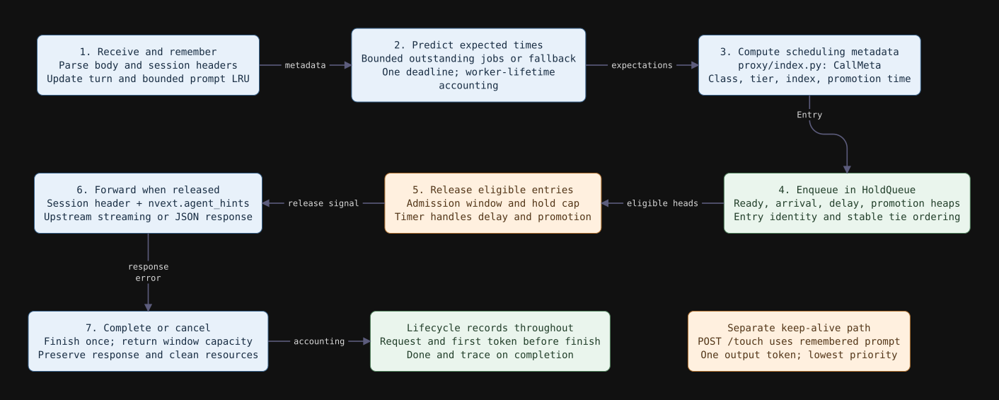
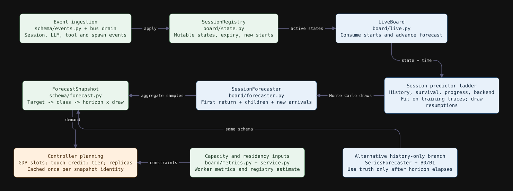
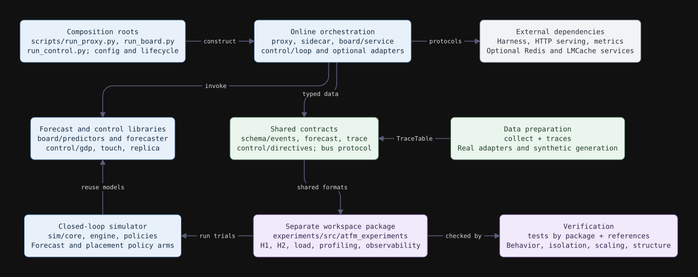
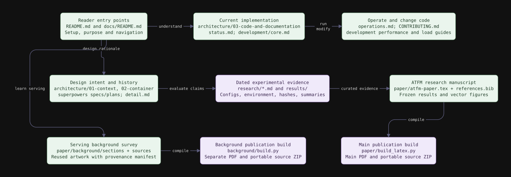

# ATFM: code and documentation architecture

[Download the PDF edition](atfm-architecture.pdf), with landscape diagram pages and clickable source links.

This guide maps the implementation at **30 September 2026**, including bounded prediction admission, isolated board computation, exact peer-rank counts, bounded upstream pool sharding and forecast-driven LMCache warming (GPU results pending). It explains where state lives, how a request becomes evidence and a control decision, and which documents describe each layer. The diagrams describe current code boundaries; the older [context](01-context.md) and [container](02-container.md) views describe broader design intent.

ATFM is a forecasting and admission layer around an LLM serving system. It observes agents during their tool phases, estimates when they will resume using the model, and uses that information to order or delay eligible work. The serving engine owns token generation and the actual KV tensors. ATFM owns observations, predictions, scheduling state, and control requests.

## Diagram atlas

| View | Question it answers | Editable source |
| --- | --- | --- |
| [Runtime topology](#1-runtime-topology) | Which processes communicate, and what crosses each boundary? | [reladraw](figures/03-runtime.reladraw) |
| [Request lifecycle](#2-request-lifecycle-and-queue-ownership) | Where can a request wait, fail, or release resources? | [reladraw](figures/04-request.reladraw) |
| [Forecast and control](#3-from-events-to-forecasts-and-decisions) | How do tool observations turn into scheduling decisions? | [reladraw](figures/05-forecast.reladraw) |
| [Cache warming](#4-forecast-driven-cache-warming) | How does a forecast become a cache warm? | [reladraw](figures/10-prefetch.reladraw) |
| [Code composition](#5-code-composition-and-extension-points) | Which modules own which responsibilities? | [reladraw](figures/06-code.reladraw) |
| [Evaluation](#6-evaluation-and-observability) | What does each evidence path show? | [reladraw](figures/07-evaluation.reladraw) |
| [Documentation](#7-documentation-and-publication-architecture) | Where should a change or a claim be documented? | [reladraw](figures/08-documentation.reladraw) |

Open an SVG directly to zoom. Blue boxes are runtime code, orange are control responsibilities, green are data/contracts/documents, purple are evaluation/build tooling, and gray are external systems. Arrows describe the labeled interaction or dependency; they do not imply that every box is a separate process. Alternative paths and configuration-dependent behavior are called out in the text.

## 1. Runtime topology


The deployed composition has three ATFM service roles: the proxy, board, and control loop. The sidecar runs inside the harness. Controller **planning** lives with the board; controller **delivery** lives in `ControlLoop`. This distinction matters when interpreting latency and failures: a board forecast, a planned hold, and an acknowledged proxy update are separate operations.

| Boundary | Implementation | Responsibility and exchanged data |
| --- | --- | --- |
| Harness → proxy | [proxy/app.py](../../src/atfm/proxy/app.py), [config.py](../../src/atfm/proxy/config.py) | OpenAI-compatible chat request, session identity, class and deadline metadata. OSL from `max_completion_tokens`, else `max_tokens`. |
| Harness → sidecar | [sidecar/adapters.py](../../src/atfm/sidecar/adapters.py), [core.py](../../src/atfm/sidecar/core.py) | Tool execution, result preservation, progress extraction, timeout handling. Harness-specific adapters live beside these shared modules. |
| Producers → bus | [schema/events.py](../../src/atfm/schema/events.py), [bus/](../../src/atfm/bus) | Typed session, LLM, tool and spawn observations. The launch scripts use JSONL. |
| Proxy → serving frontend | [proxy/app.py](../../src/atfm/proxy/app.py) | Released request with `nvext.agent_hints` and session header; upstream response is streamed or returned as JSON. |
| Proxy → board | [proxy/board_client.py](../../src/atfm/proxy/board_client.py) | Budgeted expected service and next-tool duration used in request scoring. |
| Board → worker metrics | [board/metrics.py](../../src/atfm/board/metrics.py), [board/service.py](../../src/atfm/board/service.py) | Configured Prometheus endpoint supplies worker capacity and cache-related signals. A frontend-only metrics page may not contain these. |
| Loop → board → proxy | [control/loop.py](../../src/atfm/control/loop.py), [directives.py](../../src/atfm/control/directives.py) | Tick, fetch decisions, validate/expire holds, send bounded batches, validate acknowledgements. |
| Loop → optional cache actuator | [control/lmcache.py](../../src/atfm/control/lmcache.py), [lmcache_protocol.py](../../src/atfm/control/lmcache_protocol.py) | MP 0.5.5 L2 → L1 (CPU) prefetch; completion checked inline or, with `--lmcache-async`, later. No pinning or GPU placement. |

### HTTP surface

Routes are registered by per-application `ProxyRuntime` and `BoardRuntime` instances, avoiding shared module-level application state.

| Service | Endpoint | Meaning |
| --- | --- | --- |
| Proxy | `POST /v1/chat/completions` | Main admission and forwarding path. |
| Proxy | `POST /directives`, `POST /directives/batch` | Apply individual or batched hold updates. |
| Proxy | `POST /gate` | Check whether a deferrable tool/spawn should wait. |
| Proxy | `POST /touch` | Replay a remembered prompt with one generated token at lowest priority. |
| Proxy | `GET /session/{session_id}/prompt` | Retrieve remembered prompt for optional cache actuation. |
| Proxy | `GET /state`, `GET /healthz` | Queue state, caller outcomes, outstanding/running prediction work, and health. |
| Board | `POST /tick` | Drain observations and produce the next forecast snapshot. |
| Board | `POST /predict` | Return per-request expectations under a time budget. |
| Board | `GET /snapshot`, `GET /state` | Published quantiles; prediction freshness and stage timings. |
| Board | `POST /directives` | Plan once per snapshot; return cached holds, touches, tier (with prefetch) and replica. |
| Board | `GET /healthz` | Health response. |

## 2. Request lifecycle and queue ownership



`ProxyRuntime` parses the request, assigns session/turn metadata, remembers the prompt, and obtains expectations. Prediction failure or a missed budget falls back to local estimates. The monotonic budget includes dispatch and execution. `proxy/prediction.py` admits at most `prediction_limit` unfinished jobs (four by default); excess calls immediately use fallback. A timed-out or cancelled caller leaves its running job counted until completion. Board HTTP phases use the remaining budget. Event-loop stalls can delay timeout handling; remote computation is not forcibly cancelled.

[CallMeta and index calculation](../../src/atfm/proxy/index.py) translate request metadata into scheduling fields. [HoldQueue](../../src/atfm/proxy/queue.py) owns those fields while the request waits. The application waits on an entry's release event and then forwards upstream. Completion and cancellation return admission capacity exactly once, including streaming cleanup.

The queue has several coordinated indexes rather than repeatedly sorting the entire backlog:

| Structure | Purpose |
| --- | --- |
| Entry identity maps | Locate live entries and reject stale heap records. |
| Ready heap | Select highest tier, then highest index, then earliest arrival; insertion sequence resolves ties. |
| Arrival heap | Support arrival ordering for overflow behavior. |
| Delayed heap | Wake requests whose `not_before` time has arrived. |
| Promotion heap | Raise eligible interactive requests when their slack expires. |
| Peer histogram | Count distinct priority values per tier for exact outgoing rank hints; excludes released entries. |
| Directive map | Store per-session release time, reason and expiry. |
| Timer and release event | Connect time-based eligibility to asynchronous request handlers. |

Ordinary heap insertions/removals cost `O(log Q)` for `Q` queued entries. This does **not** make every queue operation logarithmic: directive batches, diagnostic snapshots, stale-record cleanup and index rebuilds have additional work. Batched updates avoid repeating a full backlog pass for every individual hold. The queue also caps holds and has overflow behavior; it is a scheduling mechanism with explicit escape paths.

[Peer ranking](../../src/atfm/proxy/peers.py) scans U distinct indices in the requested tier,
with expected O(1) count updates and O(U) additional space across tiers. It avoids
building a list and array per release; worst-case U equals Q. Strict ties, held
peers and empty-tier behavior match the former scan. Diagnostic snapshots still
scan entries. The [paired study](../research/2026-09-28-proxy-ranking.md) also records
a rejected single-pool change; the subsequent sharded transport is described below.

Trace phases distinguish prediction wait, admission wait and handler dispatch
following slot release. Holds are included in admission wait; separate percentile
values do not add up to a request percentile.

[Upstream transport](../../src/atfm/proxy/transport.py) balances open responses
across 16 HTTPX pools for initial windows above 20; smaller windows keep stock
HTTPX. The connection caps sum to 100. Streaming close or pre-header failure
returns occupancy exactly once. Pools share a verifying TLS context; proxy
settings select stock HTTPX, and injected clients remain caller-owned. See the
[transport study](../research/2026-09-28-sharded-transport.md) for limits and rollback.

The bounded prompt LRU is a record of request inputs, not a tensor cache. A touch consumes real serving work and records success only when the upstream call succeeds. Keeping it separate from the main request lifecycle makes its cost visible.

### Sidecar execution boundary

The subprocess path owns process creation, streamed output, draining and process-group termination on timeout. `_ToolEvents` in [sidecar/core.py](../../src/atfm/sidecar/core.py) shares parser dispatch with wrapped executors. Progress matches stop the parser chain; data matches can allow subsequent parsers to inspect the same line. Parser state belongs to an individual execution.

A wrapped external executor may expose output only after completion. Those observations retain completion timestamps; they cannot be interpreted as live progress samples. Only the subprocess owner may terminate its process group. Sharing parser logic does not merge these distinct lifecycle contracts.

## 3. From events to forecasts and decisions



### State and transport

[SessionRegistry](../../src/atfm/board/live.py) owns current session phase, tool state, context size, activity/expiry bookkeeping and newly observed starts. [LiveBoard](../../src/atfm/board/live.py) consumes the appropriate start interval and advances the forecaster. Neither is a durable fleet database. The design assumes an owner of mutable live state; replicating the service requires an explicit state/ownership strategy. For sessions seen only at the proxy (no sidecar tool events), `SessionRegistry(gap_after_done=True)` (`run_board.py --gap-after-done`) opens a synthetic `__gap__` tool phase at each `llm.done`, so the elapsed-conditioned `__gap__` duration model learned from AgentX traces applies; the next `llm.request` records the gap in tool history.

The [JSONL reader](../../src/atfm/bus/jsonl.py) tracks file identity and byte offset. A drain reads newly appended complete records up to its observed file-size boundary. Malformed complete records are consumed and counted; incomplete trailing records wait for a later drain. Rotation and observed truncation reset the cursor. This removes repeated historical file parsing, but does not supply transactional acknowledgement or exactly-once processing.

The [Redis implementation](../../src/atfm/bus/redis.py) is a usable library alternative with a stream cursor and optional cursor file. It is not selected automatically by the shipped launch commands. Stream retention, cursor persistence and application of events remain separate concerns. [InMemoryBus](../../src/atfm/bus/memory.py) serves local composition and tests.

### Board worker and published reads

[ControlWorker](../../src/atfm/board/execution.py) owns one unfinished control job.
Ticks, planning, and metrics updates share that owner; extra HTTP control requests
receive 503. A successful tick publishes a complete [Publication](../../src/atfm/board/publication.py):
version, monotonic capture time, scalar prediction view, forecast, and encoded
snapshot. [BoardReader](../../src/atfm/board/serving.py) serves the previous complete
view during computation. Publication/read locks cover only a reference swap/read.
Request prediction is an expected O(1) session lookup; per-tick projection is
O(S + D) for S sessions and D duration samples visited across distinct means.

Prediction age includes computation and defaults to at most three tick intervals
(minimum one second). Expired views trigger proxy fallback. New events are not
visible until publication. Cancellation retains control ownership until completion;
shutdown drains accepted work. `/state` exposes freshness, admission and stage
timings. Thread isolation still shares the GIL. The [execution diagram](figures/09-board-isolation.svg)
and [paired study](../research/2026-09-28-board-isolation.md) detail the boundary and evidence.

### Prediction and aggregation

The [predictor interface](../../src/atfm/board/predictors/base.py) separates fitting, resumption draws, next-call input size and spawn prediction. Models build from history and elapsed time toward progress and shared backend factors:

- [duration.py](../../src/atfm/board/predictors/duration.py): history and survival-conditioned duration models.
- [progress.py](../../src/atfm/board/predictors/progress.py): progress-informed remaining work and timing.
- [backend.py](../../src/atfm/board/predictors/backend.py): shared backend factors that can correlate resumptions.
- [series.py](../../src/atfm/board/predictors/series.py): history-only aggregate baselines, composed through `SeriesForecaster` instead of per-session aggregation.

For a horizon `h` and Monte Carlo draw `m`, the endogenous first-return contribution is conceptually:

```text
KV(h,m) = sum over sessions i of 1[R(i,m) <= h] * ceil(ISL(i,m) / block_size)
PF(h,m) = sum over sessions i of 1[R(i,m) <= h] * ISL(i,m)
```

[SessionForecaster](../../src/atfm/board/forecaster.py) adds one level of predicted children and exogenous new-session arrivals. `ForecastSnapshot.samples[target][class]` has shape `(number_of_horizons, number_of_draws)`. Its KV quantity is first-resumption demand, not instantaneous resident occupancy. Its prefill quantity is input-token demand, not measured cache-miss-adjusted GPU work.

The main per-session aggregation scales roughly as `O(N H M)` for `N` sessions, `H` horizons and `M` draws, with additional generated-child and exogenous-arrival work. Holding `H` and `M` fixed makes that term linear in fleet size. Increasing all three simultaneously is materially more expensive. The code does not require an all-pairs session comparison for this aggregation.

[Calibration](../../src/atfm/board/calibrate.py) and replay evaluation belong to the model/evidence pipeline. Series baselines only consume a horizon's truth after its window has elapsed, preventing future outcomes from leaking into a prediction. [Resumption quantiles](../../src/atfm/board/resumption.py) condition on finite draws; they do not by themselves express the probability of returning.

### Planning and delivery

| Planner | Code | Decision and limitation |
| --- | --- | --- |
| GDP | [gdp.py](../../src/atfm/control/gdp.py) | Place deferrable sessions into slots under empirical demand/capacity constraints, delay caps and tenant accounting. Greedy allocation is a heuristic. |
| Touch | [touch.py](../../src/atfm/control/touch.py) | Spend bounded credit on eligible cache-preservation actions using expected return and residency/frontier estimates. |
| Tier | [touch.py](../../src/atfm/control/touch.py) | Produce placement recommendations; logged unless an actuator is configured. |
| Prefetch | [prefetch.py](../../src/atfm/control/prefetch.py) | Emit `TierDirective(action='prefetch', tier='cpu')` warms timed by a calibrated lead-time model; appended to the `tier` list. See [section 4](#4-forecast-driven-cache-warming). |
| Replica floor | [replica.py](../../src/atfm/control/replica.py) | Recommend a minimum replica count; the launch path logs this, rather than running an external autoscaler. |

GDP uses exact empirical order-statistic thresholds, indexed slot checks where applicable, and a per-plan cache of hold-window boundaries. These optimizations reduce repeated work without making joint feasibility universally logarithmic. See [control scaling](../development/control-scaling.md) for precise bounds, adversarial cases and measurements. Deployment's multi-slot `GdpPlanner` and the simulator's GDP-lite policy are distinct algorithms.

Directive responses are cached by snapshot object identity because planning can consume credit or change planner state. Repeated polls must not spend that budget again. Delivery validates schemas and expiries, batches holds, and checks that the proxy acknowledgement accounts for every submitted entry. Fail-open counters are operational evidence; they are not a distributed transaction or a guarantee that a cache action completed.

## 4. Forecast-driven cache warming


The stage E software ([design](../superpowers/specs/2026-09-30-stage-e-design.md)) is the first path from a forecast to a cache action. It moves a session's KV from the LMCache filesystem tier (L2) into CPU memory (L1) before the session is predicted to return, so the reload is off the request's critical path. It targets proxy-only deployments: the client sends chat requests with an `x-atfm-session` header and no sidecar tool events exist.

1. **Proxy.** Forwards each request to vLLM, remembers its prompt and writes LLM request/done events to the JSONL bus.
2. **Board.** `run_board.py --gap-after-done` turns the time after each call into a `__gap__` tool phase (section 3). The predictor is trained on a held-out table, and [resumption quantiles](../../src/atfm/board/resumption.py) give q10, q50 and q90 seconds until each session returns. [configure_controllers](../../src/atfm/board/service.py) builds a `PrefetchPlanner` from the `prefetch` section of the `--control` configuration. Its directives are appended to the `/directives` `tier` list and planned once per snapshot, like the other controllers.
3. **PrefetchPlanner** ([prefetch.py](../../src/atfm/control/prefetch.py)). Lead time is `overhead_s` + context tokens × `bytes_per_token` / `warm_bytes_per_s`. A session that is not running and has at least `min_tokens` of context gets `TierDirective(action='prefetch', tier='cpu')` if its trigger quantile is inside lead + `interval_s` + `margin_s`. The trigger is `q10` by default or `q50`. A session whose q90 is below the lead is skipped, because the warm could not finish even before a late return. Each session turn gets one warm, or another after `rewarm_after_s`. Candidates are ordered by q10 and capped per plan. Bytes in flight stay within `budget_bytes` until the session returns or the directive expires.
4. **Control loop** ([loop.py](../../src/atfm/control/loop.py), `run_control.py --lmcache ... --lmcache-async`). Each step it ticks the board, fetches directives and passes each `tier` directive to the actuator. It then reconciles pending warms and logs `tier_applied`, per-status `cache_*` counts and cumulative `cache_outcomes`.
5. **Actuator** ([lmcache.py](../../src/atfm/control/lmcache.py)). Reads the prompt from the proxy's `/session/{id}/prompt` and gets token ids from vLLM `/tokenize`. It checks LMCache version 0.5.5, chunk size and health, then posts `/cache/prefetches` with `source_tier='l2'` and `target_tier='l1'` for complete chunks. Synchronous mode polls until `completion_timeout_s`. Asynchronous mode returns `submitted` and polls on later steps, because real warms take seconds. A warm is `completed` only when every expected key is found; otherwise it is `partial` or `unknown`.
6. **vLLM** loads L1 hits through its LMCache connector at request time and recomputes misses. GPU prefix caching is disabled in these runs.

The stage E [arms](../../experiments/src/atfm_experiments/gpu_cache/arms.py) calibrate with stage C values: 147,456 bytes per token (Qwen3-4B) and a 1.4 GB/s warm rate. They also set 0.2 s overhead, a 2 s interval, a 1 s margin, eight warms per plan and a budget of half the CPU tier. [build_holdout_train.py](../../scripts/build_holdout_train.py) uses `exclude_traces` to remove the replayed roots and their children from the AgentX training table, and records hashes.

| Part | Implementation status | Real-GPU status |
| --- | --- | --- |
| PrefetchPlanner and board wiring, `__gap__` phase, held-out table, OSL field | Implemented. Unit tests: [test_prefetch.py](../../tests/control/test_prefetch.py), [test_prefetch_service.py](../../tests/board/test_prefetch_service.py), [test_gap_phase.py](../../tests/board/test_gap_phase.py), [test_agentx_holdout.py](../../tests/traces/test_agentx_holdout.py), [test_requested_osl.py](../../tests/proxy/test_requested_osl.py) | **Ran in stage E** on H100 SXM: 124 forecast-driven directives, no errors. |
| Actuator, synchronous L2 → L1 warm | Implemented; [test_lmcache.py](../../tests/control/test_lmcache.py) | **Validated in stage C** on H100 SXM and A100 ([retrieval paths](../research/2026-09-30-retrieval-paths.md)). Contexts warmed ahead of time beat recomputation at every tested length. The directive was built by hand, not produced by a forecast. |
| Asynchronous warms and outcome logging | Implemented; [test_loop_lmcache.py](../../tests/control/test_loop_lmcache.py) | **Ran in stage E**: submitted and reconciled live; 26 of 108 settled warms complete, 82 partial. |
| End-to-end warming driven by forecasts | `replay --arm` with `direct`, `proxy` or `atfm`; Pod plans `stage-e-a`, `stage-e-b` | **Inconclusive** ([stage E](../research/2026-09-30-stage-e.md)): run-order drift exceeded arm effects; calls left a median 1.6 s, too little to warm ~80k tokens. No effect claimed. |

The atfm arm leaves out holds, GDP, touches and GPU placement; stage E compared `q10` and `q50` (re-warm after 30 s) triggers.

## 5. Code composition and extension points



| Area | Owns | Change here when… |
| --- | --- | --- |
| [schema/](../../src/atfm/schema) | Events, canonical traces and forecast layout | A cross-module data contract changes. Keep axis and class ordering stable. |
| [bus/](../../src/atfm/bus) | Event publication and drain semantics | Adding transport, retention or reader behavior. |
| [sidecar/](../../src/atfm/sidecar) | Harness adapters, execution, gating and parsers | Supporting a harness/tool without altering tool results. |
| [proxy/](../../src/atfm/proxy) | Request metadata, queue, HTTP lifecycle, prediction client | Changing admission or forwarding. Keep resource cleanup at the owning boundary. |
| [board/](../../src/atfm/board) | Registry, predictors, aggregation, replay, calibration and service | Changing observed state or forecast behavior. |
| [control/](../../src/atfm/control) | Planning (including prefetch), typed decisions and delivery adapters | Adding a control action; distinguish recommendation from actuation. |
| [collect/](../../src/atfm/collect), [traces/](../../src/atfm/traces) | Trace acquisition, conversion, held-out filtering and synthetic families | Adding a corpus or generation recipe. |
| [sim/](../../src/atfm/sim) | Virtual time, worker/router model and policy hooks | Studying feedback from decisions to subsequent workload. |
| [eval/](../../src/atfm/eval) | Forecast and serving metrics | Changing how outcomes are scored, rather than how requests execute. |
| [dynamo/](../../src/atfm/dynamo) | Local external-serving launch support | Changing local integration setup. |
| [experiments/](../../experiments/README.md) | Trial orchestration, load generation, profiling and optional analytics | Adding a study or benchmark. Core runtime must not import this workspace package. |
| [scripts/](../../scripts) | CLI composition and maintenance entry points | Exposing library behavior as a command. |

This is a responsibility map, not a claim that every import forms a strict layer. Simulation intentionally reuses forecasting and scheduling libraries while owning separate virtual worker state. Experiments depend on `atfm`; [package-boundary tests](../../tests/test_package_boundaries.py) guard the reverse direction.

[Offline policy tuning](../development/policy-tuning.md) composes the HTTP evaluator
with a bounded plan, health/constraint checks, explicit objective and Pareto report.
`load/tune.py` randomizes paired search blocks, writes a frozen selection, then
validates it on disjoint seeds. Statistical checks operate on run blocks, not
correlated individual calls. Results can retain the baseline or remain inconclusive;
no runtime setting is applied. Candidate proposal, measurement and validation are
separate responsibilities, enabling later search algorithms without changing the
measurement contract.

Functions stay within the project's 20-physical-line limit, checked by [check_function_size.py](../../scripts/check_function_size.py). Small functions should name meaningful operations and leave lifecycle ownership visible. Avoid splitting invariants across unrelated helpers merely to satisfy the line count. See the [core developer guide](../development/core.md) for ordering, RNG, parser, queue and controller contracts.

## 6. Evaluation and observability


There are three software-only evidence paths, and a separate real-GPU path described below:

1. **H1 replay** fits on training data, advances held-out events and scores forecasts against later observations. It measures forecast quality. It does not show how a different policy would have changed the recorded trajectory.
2. **H2 simulation** runs paired programs/seeds under alternative policy arms. [Simulator](../../src/atfm/sim/core.py) owns a heap of virtual events; [engine.py](../../src/atfm/sim/engine.py) models worker service, router affinity and cache residency. Decisions alter later request arrival times. This supports controlled policy comparisons under the model's assumptions, not GPU throughput claims.
3. **HTTP load trials** run real proxy/board/control code against a fake worker in separate processes. [load/runtime.py](../../experiments/src/atfm_experiments/load/runtime.py) owns setup, clients and teardown; [report.py](../../experiments/src/atfm_experiments/load/report.py) owns summaries. These trials expose CPU, serialization, queueing and transport overhead without requiring GPU hardware.

Synthetic families support large fleets without collecting an equivalently large real corpus. Iterative program generation avoids recursion depth as a fleet-tree limit while preserving seeded order. Simulator event insertion/removal is heap-based; total runtime also includes event handlers, forecasting and policy work. A cheap heap does not make an expensive tick cheap.

[CPU benchmarks](../../experiments/src/atfm_experiments/benchmark_cpu.py), [GDP benchmarks](../../experiments/src/atfm_experiments/benchmark_gdp.py) and [profiling](../../experiments/src/atfm_experiments/profile_bottlenecks.py) separate setup from the measured operations. [Performance guidance](../development/performance.md) explains why Python remains appropriate for orchestration and where native kernels might be justified by profiles. Moving code to Rust does not eliminate repeated scans, unnecessary HTTP calls or unfavorable scaling.

[Tool trace export](../../experiments/src/atfm_experiments/tool_traces.py) and the [Phoenix smoke workflow](../development/observability-tests.md) are optional experiment infrastructure. They export completed event records for agent-level inspection using OpenInference/OTLP. They are not required runtime dependencies or replacements for queue/CPU measurements.


### Real GPU compatibility check

The [GPU validation runner](../development/gpu-cache.md) owns isolated vLLM and
LMCache processes, clears only its own idle CPU cache, verifies completed disk-to-CPU
warming, and requires real external-cache reuse with identical generated output.
It keeps the serving dependencies outside the core package. The
[recorded RTX 4060 results](../research/2026-09-28-gpu-cache.md) establish this
contract, not an end-to-end board policy or H100 performance benefit.

On rented Runpod GPUs, `pod_setup.sh` prepares a Pod and `pod_round.sh <plan>` runs a seeded plan from `experiments/gpu-cache/plans/` with per-step archives and a stop watchdog. [Rounds 2](../research/2026-09-29-gpu-round2.md) and [3](../research/2026-09-30-gpu-round3.md) ran with ATFM control disabled and characterize the vLLM/LMCache baseline. [retrieval.py](../../experiments/src/atfm_experiments/gpu_cache/retrieval.py) (stage C) times cold, on-demand L2 and actuator-warmed L1 requests. [replay.py](../../experiments/src/atfm_experiments/gpu_cache/replay.py) with [arms.py](../../experiments/src/atfm_experiments/gpu_cache/arms.py) (stage E) runs the proxy, board and control loop as owned processes; the first run was [inconclusive](../research/2026-09-30-stage-e.md).

### Verification map

| Contract | Evidence location |
| --- | --- |
| Queue ordering, ties, delayed release and batch behavior | [tests/proxy/](../../tests/proxy), including scan-reference comparisons |
| GDP equivalence, constraints and scaling cases | [tests/control/](../../tests/control), including an original-planner reference |
| Event transport and malformed/partial records | [tests/bus/](../../tests/bus) |
| Parser semantics, subprocess and harness behavior | [tests/sidecar/](../../tests/sidecar) |
| Forecast and serving scores | [tests/eval/](../../tests/eval) and board/simulation tests |
| Package isolation and function-size limits | [test_package_boundaries.py](../../tests/test_package_boundaries.py), [test_code_structure.py](../../tests/test_code_structure.py) |
| Algorithmic performance contracts | [tests/performance/](../../tests/performance) |
| Measured refactor comparisons | [modularity result artifacts](../research/results/modularity-2026-09-28) |

A passing functional test, an unchanged seeded output and a timing result establish different things. Preserve all relevant evidence when changing a hot path; do not infer GPU behavior from fake-worker trials.

## 7. Documentation and publication architecture



| Document family | Purpose | Update trigger |
| --- | --- | --- |
| [Root README](../../README.md), [documentation index](../README.md) | First-run experience and navigation | Commands, package layout or recommended reading changes. |
| This guide and [core development](../development/core.md) | Current module boundaries and invariants | Refactor, ownership change, new endpoint or contract. |
| [Status](../status.md) | Implemented versus externally validated capability | New integration evidence or a discovered limitation. |
| [Operations](../operations.md) | Service composition and configuration | Launcher/configuration/operational behavior changes. |
| [Performance](../development/performance.md), [control scaling](../development/control-scaling.md), [load testing](../development/load-testing.md) | Cost models and reproducible evaluation workflows | Hot-path changes or new benchmark methods. |
| [Architecture specification](../superpowers/specs/2026-09-22-atfm-architecture-design.md), [design-record index](../superpowers/README.md), [master plan](../../detail.md) | Rationale, intended scope and historical decisions | A deliberate design revision. Historical plans remain historical. |
| [Research index](../research/README.md) and dated notes/results | Workload-specific evidence with provenance | A new experiment; retain prior results with their dates. |
| [Main paper](../paper/README.md) | ATFM hypotheses, mathematics and curated results | A claim, algorithm or cited evidence changes. |
| [Background survey](../paper/background/README.md) | LLM serving, KV caches and related systems | Source review or tutorial updates, with a revised cutoff. |

### Publication pipelines

The main manuscript uses `docs/paper/atfm-paper.tex`, `references.bib`, vector figures in `latex-fig/`, and frozen evidence described by its result manifest. `build_latex.py` builds the PDF and optionally a portable source bundle. Earlier HTML material is a separate publication path and is not automatically synchronized with LaTeX edits.

The background survey has its own `sections/`, bibliography/source metadata, figure inputs and `build.py`. Its reproduced paper figures have a [provenance manifest](../paper/background/figures/papers/manifest.json) recording attribution and licensing. Published artwork explains those systems; the diagrams in this guide explain this repository's specific implementation.

Changing code does not regenerate either paper, and rebuilding a PDF does not validate code. A behavior change should first update implementation contracts and tests, then the relevant evidence and manuscript claims. Keep the survey's general explanation separate from local measured results.

### Keeping the diagrams current

The `.reladraw` files in [figures/](figures) are the editable sources; their matching SVGs are checked-in rendered artifacts. Regenerate from the repository root:

```bash
for source in docs/architecture/figures/*.reladraw; do
  npx reladraw "$source" -o "${source%.reladraw}.svg"
done
```

Review the rendered output after editing. Check labels against the module/endpoint tables, distinguish process boundaries from logical modules, and keep optional or advisory paths explicitly labeled. Link a new module to its owning view rather than growing a single diagram until it is unreadable.

### PDF edition

Run `docs/architecture/build_pdf.sh` from the repository root. It requires Pandoc,
XeLaTeX with the standard LaTeX packages, Inkscape and DejaVu fonts. The build
uses this Markdown file and the checked-in SVGs, preserves vector artwork,
and writes `docs/architecture/atfm-architecture.pdf` plus a delivery copy under
`output/pdf/`. `pdf-layout.lua` supplies landscape figure pages and resolves
source links against the documented Git revision; `pdf-layout.tex` controls
typography and page furniture. Review rendered pages after content changes.
