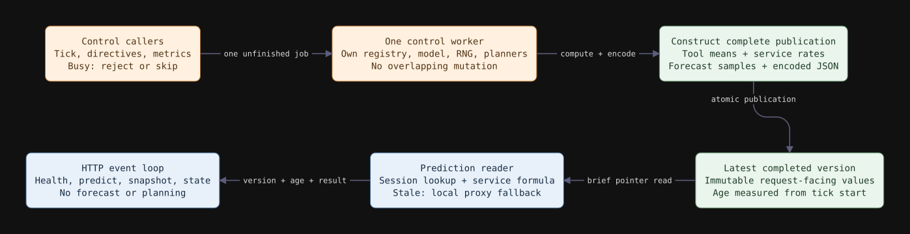

# Board computation isolation and prediction freshness

**Implemented:** `2bc3f8b`, compared with `a651518` (prediction overload protection).
**Date:** 28 September 2026. CPU-only HTTP services with a synthetic worker.

The change makes board predictions more available during control computation.
It does **not** improve end-to-end latency in these trials: at 1,024 sessions,
board event-loop p95 delay fell from roughly 90 ms to 1–2 ms and timely prediction
coverage increased, but client p95 increased in all three pairs. The additional
zero-hold-delay comparisons also regressed. Keep both outcomes when assessing
this implementation; prediction availability is not policy utility or throughput.

## What was actually blocking

`BoardRuntime.tick` previously invoked event draining and `LiveBoard.step`
synchronously inside an async HTTP handler. `directives` similarly computed
resumption draws and controller plans on that event loop. Prediction calls used
`asyncio.to_thread`, but could not start or deliver their responses while the
loop was occupied. There was no long-held registry lock to shorten.

The fresh 1,024-session baseline recorded board heartbeat p95 delay of
88.935–92.318 ms. This measures event-loop scheduling delay, not a registry-lock
wait. The previous overload study used a different revision and execution time;
its numerical results are not substituted for this paired baseline.

## Implementation and ownership

- `board/execution.py`: one `ControlWorker` with one unfinished job at a time.
  Registry/model/RNG changes, forecasting, directives, and metrics updates share
  this owner. Busy or closed HTTP control calls receive 503 with `Retry-After: 1`.
  A metrics scrape skips a busy update; the next scheduled scrape retries.
- `board/publication.py`: a frozen prediction projection contains per-session
  tool means, the pooled unknown-session mean, and service rates. A publication
  includes that view, version, monotonic capture time, forecast and encoded JSON.
  The brief shared lock only reads/swaps the publication reference.
- `board/serving.py`: built-in predictions perform a dictionary lookup and the
  existing service formula. They do not submit a job or read mutable registry
  state. A tick atomically publishes after projection, forecasting, and snapshot
  serialization all succeed. Snapshot requests reuse encoded bytes.
- `board/service.py`: HTTP handlers submit control jobs; directive planning and
  serialization run on the worker. Results remain cached per forecast identity,
  preserving once-per-snapshot controller side effects.

This uses single ownership plus a small projection rather than a deep copy of
session histories and the fitted model. The worker already has exclusive access
to mutable state, so copying it under a long registry lock would add work without
protecting an additional reader. Request-facing values are detached scalar data;
no progress arrays, history lists, or mutable model are shared with built-in
prediction handlers. New events become visible on the next successful publication.

Cancellation of an accepted control caller does not cancel its mutation or free
its slot. Shutdown prevents new control submissions and drains accepted work.
A failed tick preserves the old publication, **not** a transactional rollback of
consumed events or intermediate model state. Configure controllers before serving
requests. External code must not mutate the registry/model while the worker owns it.

Custom `LiveBoard` subclasses overriding either expectation method preserve the
legacy methods via the existing bounded four-job `PredictionRunner`. Their arbitrary
internal state is not projected or isolated, and a running custom method cannot
be forcibly stopped. The built-in HTTP fast path is the subject of this study.

## Freshness contract

For publication capture time c, monotonic request time t, and maximum age A:

`age = max(0, t - c)`; a view is stale when `age > A`.

Capture begins before ingestion, so forecast/serialization time counts toward age.
A slow calculation can already be stale when it publishes. Default A is
`max(1 second, 3 * tick_s)`; this study uses 1.5 seconds. The three-interval
default leaves room for cadence plus calculation/scheduling delay; it is an
operational heuristic, not a calibrated guarantee of prediction validity. Set
`--prediction-max-age` in the board launcher or `prediction_max_age_s` in
`create_board_app` / load configuration. It must be finite and positive.

`/predict` adds `prediction_version`, `prediction_age_s`, and `stale`. Expired
views return zero estimates and `over_budget: true`, which the existing proxy
rejects in favor of local fallback. Version zero holds the initial projection
and pooled estimate, and expires normally without successful ticks. Clock changes
in wall time do not refresh or expire a view; forecast/event timestamps retain
their existing wall-clock semantics. No hard real-time guarantee is claimed.

## Complexity and measurements

Let S be active sessions, D the duration observations visited across distinct
tool means (including the pooled mean), H horizons and M Monte Carlo draws.

| Operation | Cost / consequence |
| --- | --- |
| Capture prediction view | O(S + D) time, O(S) scalar map; each distinct mean evaluated once per tick. |
| Built-in prediction | Expected O(1) session lookup and fixed arithmetic/JSON, independent of S and D. |
| Publish/read pointer | O(1), a short lock; no lock spans forecasting or planning. |
| Forecast and controller algorithms | Unchanged; moving execution does not reduce their asymptotic cost. |
| Snapshot quantiles / JSON | Computed once per tick from H × M arrays; serving B bytes still costs O(B). |
| Control admission | O(1) bookkeeping; at most one unfinished job, no executor backlog. |

Board `GET /state` and load diagnostics split read, prediction computation,
prediction serialization, ingestion, projection, forecast, snapshot serialization,
directive planning and directive serialization. Each stage has count/total/max/
last duration, not a percentile histogram. Read timing includes the pointer lock;
network waits and pre-dispatch event-loop delays are measured separately by the
load client and heartbeat. Baseline sub-stage timings were not instrumented.

Across the three main 1,024-session candidate runs, mean prediction pointer reads
were 1.52–1.85 microseconds, computation 2.52–3.07 microseconds, and serialization
17.73–21.46 microseconds. Projection took less than 0.363 ms per tick. Forecast
maximums were 170–187 ms and directive-planning maximums 164–201 ms. These are
wall-clock stage measurements on this host, not isolated CPU instruction costs.
The worker still shares Python's GIL with HTTP serving; numerical operations and
thread scheduling determine how much contention remains.

## Main paired experiment

Both revisions use the same Python environment and proxy settings: four unfinished
prediction jobs, 50 ms caller budget, 64 admission slots, 64 fake-worker slots,
5 ms fake service, 128 forecast draws, 10 slots, 500 ms sleep after each control
step, three sequential calls per session, two-second burst arrival window, and
soft descriptor limit 8,192. The hold cap is 500 ms. Sizes are 256 and 1,024;
seeds 7, 8, 9 alternate before/after order. Runs are sequential, with fresh service
processes and output directories. The baseline uses a detached git worktree;
the candidate uses the working checkout with unchanged runtime source hashes.

Percentages pool prediction counts within a size/revision; latency and lag ranges
are the minimum and maximum of three **per-run p95 values**, not confidence intervals.

| Sessions | Revision | Timely prediction use | Client p95 range (s) | Board loop p95 range (ms) |
| --- | --- | ---: | ---: | ---: |
| 256 | Before | 55.82% | 0.404–0.440 | 2.061–3.859 |
| 256 | After | 63.80% | 0.391–0.500 | 0.966–1.868 |
| 1,024 | Before | 24.59% | 2.183–2.730 | 88.935–92.318 |
| 1,024 | After | 31.61% | 3.100–3.190 | 1.053–1.566 |

Coverage increased and board lag decreased in all six pairs. Client p95 increased
in five pairs and decreased in one (256 sessions, seed 8). All 23,040 calls succeeded.
All candidate views observed by the monitor were younger than 1.017 s; the board
reported zero stale/unavailable predictions. This does not mean every proxy caller
used a prediction: proxy capacity rejection, transport, and caller timing still
apply. Publication-age samples do not establish an unobserved worst-case bound.

At 1,024 sessions, proxy arrival-to-release p95 changed from 1.673–2.428 s to
2.693–2.747 s; proxy CPU totals changed from 6.331–7.009 s to 7.434–7.488 s.
Board CPU totals were 2.266–2.781 s before and 2.703–3.080 s after. These totals
include different elapsed run lengths and numbers of control steps. They are
not normalized costs for identical control work.

The workload uses beta=0 and identical board/proxy service rates, so improved
tool estimates do not directly change the index formula here. Earlier prediction
completion changes enqueue timing, overlap, event delivery and later control
inputs. Increased prediction availability also permits more HTTP prediction
transactions. Queue growth and CPU increases are observed; their precise causal
contributions are not established by these trials.

## Follow-up: zero hold delay

To test whether holds alone explain the regression, repeat the three 1,024-session
pairs with `max_hold_s=0`. Forecasting, planning, directive delivery, admission
windows and prediction transport remain enabled. This disables imposed proxy
hold delay, not the entire control path.

| Revision | Timely prediction use | Client p95 range (s) | Board loop p95 range (ms) |
| --- | ---: | ---: | ---: |
| Before | 27.76% | 2.316–2.695 | 74.938–90.298 |
| After | 32.55% | 2.634–3.038 | 1.257–1.327 |

Client p95 increased in all three pairs. All 18,432 calls succeeded. Thus removing
hold delay did not remove the regression in these runs; it does not prove a single
alternative cause. Proxy CPU remained higher (7.025–7.379 versus 6.730–6.977 s).

## Validation, provenance, and limits

The full suite passed **458 tests, five skips**, with six existing warnings.
Sixteen new isolation tests cover blocked ticks/directives, old-view serving,
cancelled callers retaining ownership, freshness boundaries, slow publications,
failed ticks, detached values, unchanged seeded forecasts, cached serialization,
metrics ownership, submission failure, invalid configuration and shutdown.
Existing overload and real-HTTP lifecycle tests also pass. All tracked Python
functions remain at most 20 physical lines.

[Archived evidence](results/board-isolation-2026-09-28/) contains all 18 case
directories under `main/` and `zero-hold/`, per-case summaries, observations,
requests, source hashes, logs, configuration, and shutdown records. The manifest
records uncompressed SHA-256 and byte lengths for 360 files; large text artifacts
are gzip-compressed. `comparison.csv` preserves individual outcomes. Both exact
executed drivers and the pytest log are included. Recorded runtime source hashes
were checked against both git revisions. All 41,472 planned calls completed;
there were no client, control, tool, session or probe errors, and no application
shutdown tracebacks. Child exit codes are -15 after harness SIGTERM, not zero.

The host is an Intel Core Ultra 9 185H with Python 3.12.13. These short local
trials use fresh HTTP connections and a fake worker, not GPU inference. The host
was not reserved; an unrelated benchmark process was observed during validation.
Alternating pairs reduces but does not eliminate machine-load and timing noise.
No confidence interval, GPU/cache benefit, or production latency improvement is
claimed. The zero-hold experiment was added after observing the main regression.

To reproduce, create clean checkouts of the revisions above, use the same
interpreter/dependencies, set `PYTHONPATH` to each checkout's `src` and
`experiments/src`, and adapt the archived drivers' absolute paths to fresh output
directories. Keep the descriptor limit and alternating run order. Never mix
results from this fresh baseline with the prior overload study's timing ranges.

The next measured target is proxy-side prediction HTTP/executor overhead and
queueing under higher prediction availability. First capture thread-aware CPU
profiles and request timing; then test an asynchronous transport or batching
against these same pairs. Board isolation is retained for explicit ownership,
bounded work, responsiveness and freshness, with its end-to-end regression
recorded rather than presented as a latency optimization.
