# ATFM: GPU results & caching tradeoffs

## Evidence report | 28-30 September 2026

ATFM's cache integration works on four GPU types, the complete 119-request agent root now finishes, and the ordinary vLLM/LMCache baseline is characterized with repeated, randomized runs. Warming a context into CPU memory ahead of its request beat recomputation at every tested length. Forecast-driven warming (stage E) ran end to end on H100s but was inconclusive, because the replayed agent left no time to warm. On a four-agent fleet with long idle gaps (stage E2), both ATFM runs cut median TTFT by about 72% against bracketing direct runs, through lower vLLM queue time; a proxy-only control (stage E3) is under way.

This edition consolidates the 28-29 September compatibility checks and first public replays with three later rounds on Runpod: round 2 (first complete large root, CPU-tier pair, A100 repeats), round 3 (seeded random repeats, Blackwell) and two targeted studies, stage C (retrieval paths) and stage E (forecast-driven warming). Earlier CPU and simulation studies remain separate; see the research index [10].

| Evidence | Result | What it establishes |
| --- | --- | --- |
| CPU warming + real inference | 22/22 chunks; 351/352 reused tokens | Supported actuator and cache integration |
| Complete public roots | All 164 requests of three roots; 41 complete-root replays | Faithful completion on H100 NVL/SXM, A100, RTX PRO 6000 |
| CPU tier 24 vs 48 GiB | 1.9x duration, 5.7x median TTFT (H100 SXM, 2+2 runs) | Capacity pressure is the dominant baseline cost on this root |
| Retrieval paths (stage C) | Warmed L1 2.5-21.6x faster than recompute | Reuse pays when the transfer is off the critical path |
| Forecast-driven warming (stages E, E2) | E: inconclusive; E2: median TTFT 3.7-3.9 s to 1.0-1.1 s | Gain on a long-gap fleet; proxy not yet separated |

### How to read the visuals

**Measured** means a retained experiment record or diagnostic. **Derived** means arithmetic using measured configuration. **Illustrative** means an explicitly assumed scenario, not an observed hardware result. Every comparison of settings is paired within one Pod: hosts with the same GPU model differed by more than the effects under study.

### Reading map

Sections 01-07 describe the setup, compatibility, workloads, first latency results, reuse, tool calls and failures. Sections 08-11 present the measured rounds: repeatability and host variance, CPU-tier capacity, chunk size and retrieval paths. Sections 12-16 cover stages E, E2 and E3. Sections 17-23 relate the measurements to memory, concurrency, transfer, warming, design choices and next experiments. Sections 24-26 provide reproducibility, accounting and sources.

---PAGE---
# 01 | What ran, and how it was measured

Every run uses Qwen/Qwen3-4B-Instruct-2507, vLLM 0.30.0 and LMCache 0.5.5 in multiprocess mode with a CPU tier (L1) and a filesystem tier (L2). ATFM control is disabled in every replay except stage E's `atfm` arms. The compatibility probe exercises ATFM's warming actuator separately. Sources: [1-4, 11-14].

| Component | Recorded configuration |
| --- | --- |
| GPUs | H100 NVL 94GB (29 Sep); H100 SXM 80GB, A100 SXM 80GB, RTX PRO 6000 Blackwell 96GB (29-30 Sep) |
| Model + tokenizer revision | cdbee75f17c01a7cc42f958dc650907174af0554 |
| Serving software | vLLM 0.30.0; LMCache 0.5.5; PyTorch 2.13.0+cu130 (CUDA 13.0 runtime) |
| Load generator | AIPerf 0.13.0; reconstruction seed 7 |
| Engine limits | Context 131,072; max sequences 2; GPU memory setting 0.55 |
| Execution / reuse | Eager; vLLM prefix caching off; LMCache external reuse on |
| CPU cache | 24 GiB L1 unless varied (48 GiB); 16-token chunks unless varied (64, 256); LRU |
| Persistent cache | Filesystem L2: network storage on 29 Sep, local container disk from round 2 |
| Pods | Runpod Secure Cloud, one GPU each, 150 GB container disk from round 2 |

### Replay contract

Each selected Weka root runs with `--num-sessions 1` and `--no-fixed-schedule`; its child tree must finish. Recorded token targets and end-to-start delays are preserved; `ignore_eos:true` requests the prescribed output length. This is closed-loop replay: service times alter wall-clock arrival times. Every replay step starts a fresh LMCache/vLLM process pair with an empty L2 directory; page cache, weights and compiled kernels stay warm after a Pod's first step.

TTFT is client-observed time to first token. External-hit ratios use before/after vLLM Prometheus counter differences. Rounds 3 and later draw run order from recorded seeds (`experiments/gpu-cache/plans/`).

### Experimental boundaries

Engine concurrency is capped at two sequences. GPU DCGM telemetry was unavailable. Sixteen-token chunks and eager mode are compatibility choices, not a tuned throughput baseline. Hardware identity, commands, installed versions, source fingerprints and raw logs are retained with each round's evidence.

---PAGE---
# 02 | Compatibility: the actuator works

A 352-token synthetic prompt requests eight output tokens. After cold inference fills the cache, the probe clears its own CPU L1, verifies it is empty, submits an ATFM CPU-prefetch directive, waits for completion, and repeats inference. It checks reuse, text equality, occupancy, locks, and shutdown [2, 3].

| Observation | RTX fresh repeat | RTX rebuilt env | H100 NVL |
| --- | --- | --- | --- |
| Cold external hits | 0 | 0 | 0 |
| Completed keys | 22/22 | 22/22 | 22/22 |
| Warm reused tokens | 351/352 | 351/352 | 351/352 |
| Text identical | Yes | Yes | Yes |
| CPU bytes after prefetch | 40,370,176 | 40,370,176 | 40,370,176 |
| Read / write locks | 0 / 0 | 0 / 0 | 0 / 0 |
| Cold HTTP elapsed | 133.17 ms | 131.78 ms | 774.09 ms |
| Warm HTTP elapsed | 101.84 ms | 108.93 ms | 244.74 ms |

These are single diagnostic observations, not cross-hardware rankings, controlled speedups, or policy measurements. The model here is Qwen3-0.6B, not the 4B public-workload model. Its KV footprint must not be substituted into the later capacity analysis. vLLM recomputes the last prompt token, explaining 351 reported reused tokens.

### Deployment failures that were resolved

The first H100 launch exceeded the six-minute readiness limit. A longer configurable deadline exposed a missing Ninja executable path. Adding the serving environment's bin directory fixed discovery. Native compilation then exposed mismatched CUDA compiler/header packages: nvcc, NVVM, and CRT were pinned to 13.0.88 alongside runtime 13.0.96. Toolkit `lib64` and unversioned `libcudart.so` links completed the native setup.

### What the success does and does not mean

The adapter confirms completed CPU warming, not merely HTTP acceptance. It rejects partial or unknown completion and reports unsupported GPU placement. CPU residency does not guarantee GPU residency or future retention. The test proves an action can work; it does not prove the forecasting board chooses useful actions under contention.

Later rounds reused the same pinned environment unchanged on H100 SXM, A100 SXM and RTX PRO 6000 Blackwell (host CUDA 13.2, driver 595.91); each served the full workload and BFCL matrix. The RTX repeats used a 0.5 GiB CPU tier, 2,048-token engine context, and a rebuilt pinned environment. H100 compatibility passed at commit `3df2d53`. Public workloads use a different model and much larger working sets [2, 3].

---PAGE---
# 03 | Public workloads and fidelity

Three complete roots were selected from the SemiAnalysis Weka corpus [5]. They were copied without root truncation and retain per-root hashes. Selection favored context-compatible, manageable cases; this is a feasibility sample, not random sampling or an official AgentX evaluation.

| Root | Requests | Source subagent groups | Max input + output | Recorded input / output |
| --- | --- | --- | --- | --- |
| Short branch | 21 | 1 | 54,926 | 818,752 / 3,949 |
| Sequential | 24 | 0 | 93,675 | 1,557,440 / 10,202 |
| Multi-branch | 119 | 3 | 118,677 | 9,906,624 / 37,635 |
| Selected total | 164 | - | 118,677 | 12,282,816 / 51,786 |

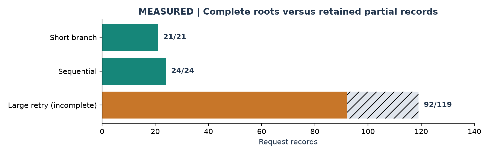

**Figure 1 - Measured completion accounting.** The large retry retained 92 completed request records; the other 27 are not evidenced as completed in that export. This does not classify them as 27 server errors. Only the first two bars represent accepted complete roots.

### What is realistic, and what is reconstructed

Weka preserves a public workload's session structure, cache-hash relationships, sizes, and delays. Prompt text is reconstructed from cache hashes; original tool arguments and results are not present. Counts derive from cache blocks rather than the exact target tokenizer. Source model identities are replaced by one Qwen model. The selected roots have no `input_types` annotations, so they cannot validate tool-name-conditioned prediction.

BFCL provides actual questions and function schemas [6]. It complements this structural replay with tool-call API checks, but no external tools are executed. Neither dataset usage here demonstrates end-to-end agent task success.

---PAGE---
# 04 | Complete-session latency results

The accepted seeded rerun at `4bcc012` finished 45 requests across two roots, with no reported errors or child truncations [1, 4]. Both produced the full requested server output-token totals. There is one run per root; reported percentiles describe those observations only.

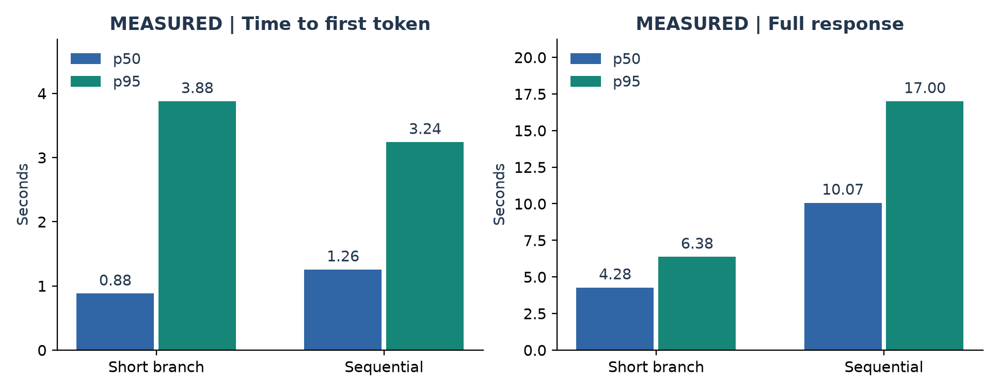

**Figure 2 - Measured request latency and TTFT.** Each panel uses its own scale. Bars compare different workloads, not competing policies. A p95 over 21 or 24 requests is unstable and is not a confidence interval.

| Metric | Short branch | Sequential |
| --- | --- | --- |
| Completed requests / children | 21/21; 1/1 | 24/24; 0/0 |
| TTFT p50 / p95 | 880.54 / 3,877.61 ms | 1,255.72 / 3,240.73 ms |
| Full request p50 / p95 | 4,281.04 / 6,378.09 ms | 10,066.22 / 17,003.67 ms |
| AIPerf replay duration | 143.93 s | 292.73 s |
| Harness elapsed | 155.92 s | 304.66 s |
| Output tokens, actual / target | 3,949 / 3,949 | 10,202 / 10,202 |

### Interpretation

Sequential requests have a larger median full-response latency, alongside more output tokens over the root. This is not evidence that cache reuse is ineffective: reuse primarily avoids prompt prefill, while new tokens still need decoding [7]. We did not isolate decode, transfer, queueing, or client scheduling time. Subtracting independently computed percentiles would not recover their phase contributions.

Replay duration includes recorded waits and session dependencies. Dividing tokens by that duration would describe this replay's delivered rate, not the H100's saturated inference capacity. A separate concurrency/load sweep is needed for a throughput claim.

---PAGE---
# 05 | High reuse, finite residency

The external-hit counters show substantial reuse in both complete roots. These counters are token-weighted totals over requests, not the fraction of unique context retained, the share of requests with a full hit, or the share of time saved [1, 4].

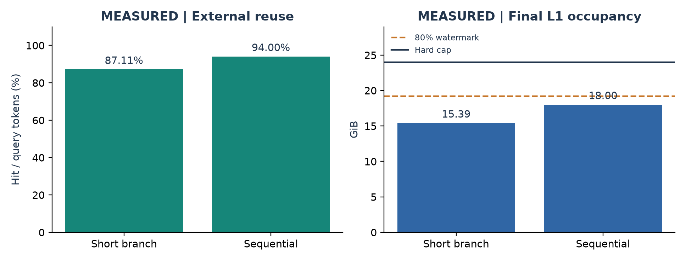

**Figure 3 - Measured external token reuse and final CPU occupancy.** The dashed occupancy line marks the configured 19.2 GiB eviction watermark; the solid line marks 24 GiB capacity. Final occupancy is not peak occupancy.

| Counter / state | Short branch | Sequential |
| --- | --- | --- |
| External hit tokens | 714,560 | 1,466,560 |
| External queried tokens | 820,262 | 1,560,190 |
| Hit / query | 87.11% | 94.00% |
| Final L1 bytes | 16,529,227,776 | 19,329,712,128 |
| Final objects | 7,006 | 8,193 |
| Final read / write locks | 0 / 0 | 0 / 0 |

### Why a high hit ratio can coexist with stalls

A repeated long prefix can dominate token counts, while a few expensive misses dominate latency. A hit in external storage still has to reach the GPU. Near-capacity allocation can require eviction or wait for locked/in-flight objects. The same prefix can be counted repeatedly across turns without representing that many distinct resident bytes.

The sequential root logged watermark-triggered evictions at 04:08:35, 04:09:47, and 04:11:46 UTC. Its 18.00 GiB final snapshot is compatible with earlier occupancy above the 19.2 GiB trigger. Zero locks at the end does not prove there was no earlier lock contention.

**Implication:** evaluate timely, useful reuse and end-to-end latency together. Maximizing an aggregate hit ratio alone is not a sufficient policy objective.

---PAGE---
# 06 | Tool-call API results

The expanded BFCL-derived matrix at `1c33fa7` made 40 requests: the first ten rows of each of four pinned categories. All responses were saved. The aggregate verdict is false because one call-shape check failed [4, 6].

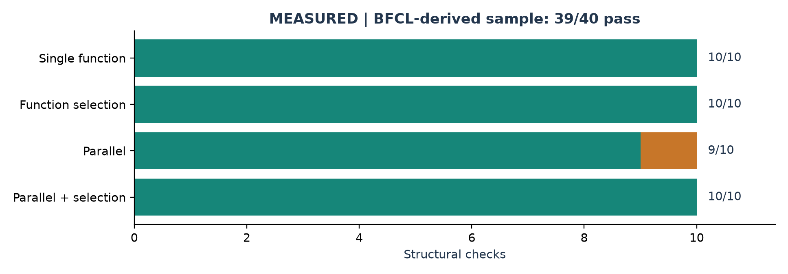

**Figure 4 - Measured structural checks, not official BFCL accuracy.** The sample passed 39/40 checks (97.5%) on the H100 NVL. The same 40 cases gave 39/40 twice on the A100 SXM and once on the RTX PRO 6000 Blackwell, always failing only `parallel_9`: with temperature 0 and seed 7 the call shapes are reproducible across Hopper, Ampere and Blackwell. Convenience sampling and simplified scoring prevent interpreting this as benchmark-level model accuracy.

### Validation and schema adaptation

Checks require an offered function name, arguments that parse as a JSON object, no length truncation, and at least two calls for parallel categories. Schema adaptation maps dict to object, float to number, and list to array; dotted function names become underscores and collisions are rejected. Questions remain unchanged. Requests use temperature zero, seed 7, and a 512-token output limit.

Initial nine-case prechecks (three per original category) passed in the retained successful precheck runs. They overlap the expanded sample and must not be added to its denominator as new independent examples. Tool-matrix timings are not presented as a latency benchmark because scratch cleanup overlapped startup.

### The one discrepancy: parallel_9

The model emitted one `find_movie_showing` call with arrays containing two movies and times. The schema permits arrays, but our check requires separate parallel calls; the pinned official reference also contains two calls. This is a supported call-shape discrepancy, not proof that a real implementation would reject the batched request.

No tools were executed; argument meaning, real side effects, and task completion were not scored. The next tool-quality experiment should use the official scorer and a safe execution harness, separately from cache-performance comparisons.

---PAGE---
# 07 | Incomplete attempts and root causes

On 29 September the larger 119-request root had no accepted complete-run result. Two distinct problems occurred: persistent-storage exhaustion and, after cleanup, timeout with CPU-cache allocation pressure. These must not be conflated [1, 4]. Round 2 resolved both (local container disk, a 2,400 s per-root limit): the root has since completed in every one of its replays (sections 09 and 13).

| Attempt | Observation | Treatment |
| --- | --- | --- |
| Fixed-schedule replay | Nested timing rejected before inference | Invalid; use recorded closed-loop delays |
| Request-count-bounded replay | 21 records but three truncated children | Rejected; bound complete root sessions |
| First session-bounded replay | 21 complete; result handler argument missing | Raw export retained; seeded rerun accepted instead |
| Shared-stack large root | Disk quota exceeded at 04:20:38 UTC | Invalid partial; logs include null-filled tails |
| Isolated large retry | 1,110 s supervisor expired; exit 124 | Incomplete; no finalized whole-root profile |

### Storage failure

Approximately 73 GiB of generated L2 cache, 18 GiB of package downloads, and 7.6 GiB of model weights accumulated on a 100 GB workspace. These approximate GiB figures already exceed 100 decimal GB when combined, before other files. The shared filesystem's `df` displayed host-wide capacity rather than the Pod's quota. Evidence files sharing the same quota were damaged during flushing.

Generated KV and download caches were reclaimed; logs and responses were retained. The isolated retry had no new disk-quota errors. Later rounds use a 150 GB local container disk, delete each replay's L2 directory after archiving, and download checksummed archives before termination.

### Later failures and fixes

Round 2's first A100 plan failed after one replay because the port preflight refused sockets still in `TIME_WAIT`; it now retries for two minutes and the plan was rerun. Stage E's first two Pods shared one host and were separated (section 12).

### Retry outcome

The fresh-cache retry at `f441de1` retained 92 unique, non-cancelled records, each with server usage, totaling 30,433 output tokens versus 37,635 for the full root. The supervisor budget included startup. Its expiry does not isolate inference slowness from startup, recorded waits, or cache work.

The retry logged 19 L1 batch-allocation warnings. One requested 4,153 blocks of 2,359,296 bytes and lacked space for 1,301 blocks: about 9.12 GiB requested and 2.86 GiB short. Allocation warnings are not automatically HTTP failures.

---PAGE---
# 08 | Repeatability and host variance

Round 2 made the large root finish and added repeats; round 3 repeated its comparisons in seeded random order on fresh Pods [11, 12]. Two properties decide how later comparisons must be designed.

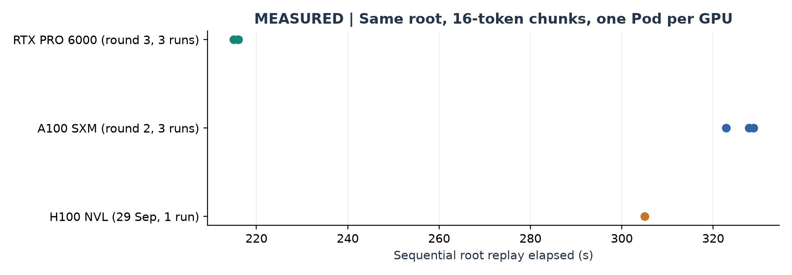

**Figure 10 - Measured replay duration of the 24-request sequential root.** One Pod per GPU type; points are runs on that Pod. The RTX PRO 6000 finished in 215-216 s against 323-329 s on the A100.

| Pod | Short root: elapsed, TTFT p50 | Sequential root: elapsed, TTFT p50 | External hit ratio |
| --- | --- | --- | --- |
| A100 SXM, round 2 (3 runs) | 150-152 s; 0.60-0.62 s | 323-329 s; 1.17-1.21 s | 87.1% / 94.0% |
| RTX PRO 6000, round 3 (2-3 runs) | 95-97 s; 0.35 s | 215-216 s; 0.68-0.69 s | 87.1% / 94.0% |
| H100 NVL, 29 Sep (1 run) | 144 s; 0.88 s | 293 s; 1.26 s | 87.1% / 94.0% |

**Repeats agree closely.** With the fixed seed and fresh caches, repeats on one Pod differed by about 1-4% in elapsed time and median TTFT. Hit ratios were identical across GPUs, so speed differences come from compute and host, not from reuse.

**Hosts differ more than the effects under study.** The same 48 GiB configuration of the 119-request root took 930 s on one H100 SXM host (round 2) and 588-591 s on another (round 3), with identical 95.9% hit ratios. The A100's sequential-root median TTFT was 1.17-1.21 s on the round-2 Pod and 1.47-1.52 s on the round-3 Pod. Consequently every capacity, chunk and policy comparison in this report is paired within one Pod, and results from different Pods are never pooled. The manifests do not yet record host CPU, PCIe or memory details that could explain the gaps.

---PAGE---
# 09 | CPU-tier capacity, measured

The 29 September analysis predicted that two about 100k-token contexts (27.5 GiB) cannot fit a 24 GiB L1. Round 2 completed the 119-request root at both sizes on one H100 SXM Pod; round 3 repeated the pair twice on another Pod in the order 48, 24, 24, 48 and once on an A100 [11, 12].

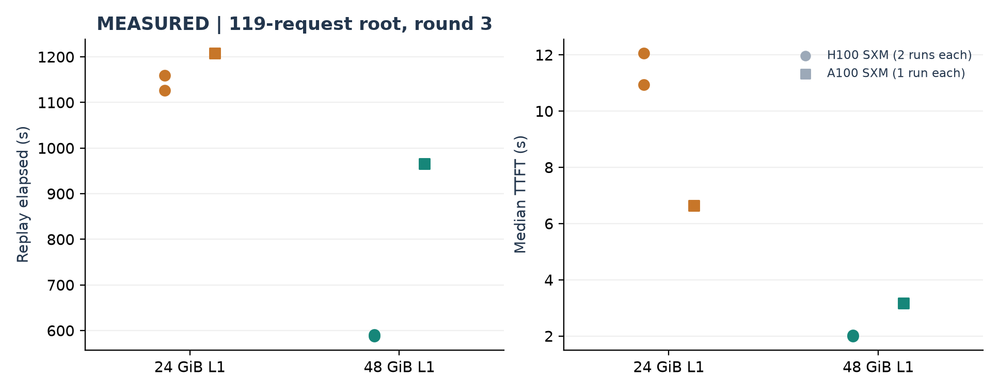

**Figure 11 - Measured 119-request root at 24 and 48 GiB.** Circles: H100 SXM, two runs per size on one Pod. Squares: A100 SXM, one run per size on one Pod. Every run completed 119/119 requests and 4/4 child branches.

| Pod, order | L1 | Elapsed | TTFT p50 / p95 | Latency p50 / p95 | Hit ratio | L1 warnings |
| --- | --- | --- | --- | --- | --- | --- |
| H100 SXM, 1st | 48 GiB | 591 s | 2.02 / 7.21 s | 5.12 / 15.95 s | 95.9% | 0 |
| H100 SXM, 2nd | 24 GiB | 1,126 s | 10.93 / 19.78 s | 13.77 / 30.78 s | 89.4% | 32 |
| H100 SXM, 3rd | 24 GiB | 1,159 s | 12.06 / 22.78 s | 14.10 / 30.83 s | 89.6% | 18 |
| H100 SXM, 4th | 48 GiB | 588 s | 2.00 / 6.21 s | 5.23 / 17.42 s | 95.9% | 0 |
| A100 SXM, 1st | 24 GiB | 1,208 s | 6.63 / 29.69 s | 12.15 / 53.94 s | 90.4% | 8 |
| A100 SXM, 2nd | 48 GiB | 966 s | 3.16 / 12.81 s | 9.68 / 38.51 s | 95.9% | 0 |

On the H100 the 48 GiB runs bracket the 24 GiB runs, so warm-up order cannot explain the gap; within-setting spread is 1-3% against a 1.9x difference. Doubling the tier halved duration and cut median TTFT 5.7x.

The counters show the mechanism: at 24 GiB, batched L1 allocations fail, the external hit ratio falls by about six points, and missed prefixes are recomputed. A failed allocation is not a failed request; all requests completed. The A100 moved the same way with one run per size. **Capacity pressure dominates this baseline** - the setting for stage E.

---PAGE---
# 10 | Chunk size, measured

The derived page 'Chunk size: objects versus granularity' explains why larger chunks reduce object counts. Rounds 2 and 3 measured the sequential root at 16, 64 and 256 tokens per chunk with the CPU tier fixed at 24 GiB [11, 12].

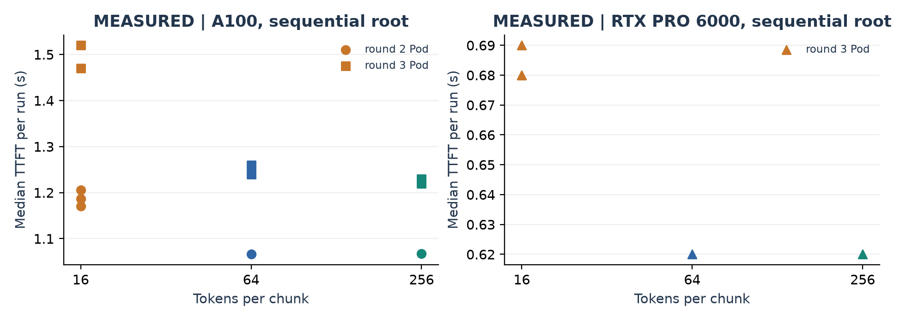

**Figure 12 - Measured median TTFT per run of the sequential root.** Markers identify Pods; results from different Pods are not pooled. Round-3 runs followed a seeded random order (A100: 16, 64, 16, 64, 256, 256).

| Pod | Chunk 16 | Chunk 64 | Chunk 256 |
| --- | --- | --- | --- |
| A100, round 2 | 1.17-1.21 s (3 runs) | 1.07 s | 1.07 s |
| A100, round 3 | 1.47, 1.52 s | 1.24, 1.26 s | 1.22, 1.23 s |
| RTX PRO 6000, round 3 | 0.68-0.69 s (3 runs) | 0.62 s | 0.62 s |

Chunks of 64 or 256 tokens lowered median TTFT by about 17% on the round-3 A100 and 9% on the Blackwell GPU, with no overlap between settings; median full latency fell less (3-7%) because decode dominates it. Hit ratios were 93.9-94.0% at every size, so the gain is not more reuse. Fewer, larger objects (6,250 versus 391 per 100k tokens) are a plausible cause that these runs do not isolate. 64 and 256 were indistinguishable here, and coarser chunks may matter more for eviction granularity than this single-session root can show.

**Implication:** 64-token chunks are a low-risk improvement for the baseline. The policy comparisons in stage E keep 16-token chunks so that they remain paired with rounds 2 and 3.

---PAGE---
# 11 | Retrieval paths: when reuse beats recomputing (stage C)

The break-even question from 'Moving KV versus recomputing it' - is retrieving cached KV faster than recomputing it? - was measured directly [13]. Each trial serves one output token for a prompt of 2k to 98k tokens in one of three states: never seen (cold recompute), resident only in L2 after an L1 clear (on-demand load), or warmed into L1 by an ATFM prefetch directive after the same clear. Three seeded, shuffled blocks per GPU; 72 of 72 trials passed with the expected reuse.

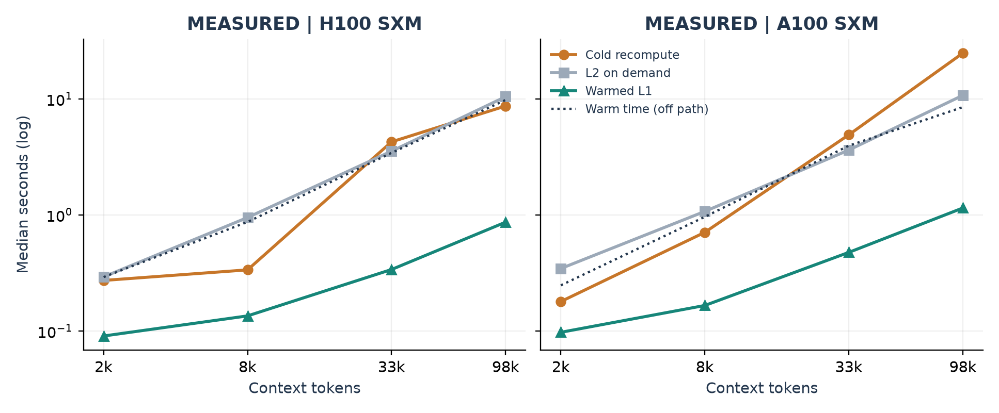

**Figure 13 - Measured medians of three blocks.** Warm time is the ATFM prefetch that precedes the warmed request; it is not in that request's time.

| Median seconds | 2k | 8k | 33k | 98k |
| --- | --- | --- | --- | --- |
| H100: cold / L2 / warmed L1 | 0.27 / 0.29 / 0.09 | 0.34 / 0.95 / 0.13 | 4.26 / 3.54 / 0.34 | 8.67 / 10.43 / 0.87 |
| A100: cold / L2 / warmed L1 | 0.18 / 0.35 / 0.10 | 0.71 / 1.07 / 0.17 | 4.90 / 3.62 / 0.48 | 24.77 / 10.72 / 1.15 |
| Warm time H100 / A100 | 0.29 / 0.25 | 0.87 / 0.96 | 3.42 / 3.94 | 9.77 / 8.49 |

**Warmed contexts win everywhere:** 2.5-12.6x on the H100 and 1.8-21.6x on the A100. **On-demand L2 loads do not reliably win:** on the H100 they were slower than recompute at every length but 33k; on the A100 they won from 33k up. L2 load and warm times were similar on both hosts (host-bound), while prefill differed about 3x (GPU-bound), so the reload-versus-recompute threshold is hardware-dependent. vLLM's histograms put the load cost in queue time: with external hits, prefill took 0.04-0.06 s at every length. L1 bytes after warming were exactly 144 KiB per token.

**Implication for ATFM:** reuse pays when the transfer happens before the request. At 98k a warm needs about 8.5-10 s of lead, and on the H100 a late warm is worse than none. The OS page cache was not dropped, so true cold-disk loads can only be slower.

---PAGE---
# 12 | Stage E: forecast-driven warming, design

Stage E asks whether ATFM, predicting when an agent session will return and warming its KV from L2 into CPU memory ahead of that return, lowers TTFT and replay duration against ordinary LMCache after its own costs [14, 15]. It uses the 119-request root at a 24 GiB CPU tier, where section 09 showed pressure.

| Arm | Path | Control |
| --- | --- | --- |
| direct | AIPerf -> vLLM | none (baseline of rounds 2-3) |
| proxy | AIPerf -> ATFM proxy -> vLLM | proxy only: isolates the hop's cost |
| atfm-q10 | AIPerf -> proxy -> vLLM | board + control loop; warm when an early return (q10) is inside lead + interval |
| atfm-q50 | AIPerf -> proxy -> vLLM | as above, trigger on the median return, re-warm after 30 s |

**Mechanism.** The proxy identifies each AIPerf conversation as one session (`--session-header x-atfm-session`) and writes request/done events. The board treats time after each call as the corpus's `__gap__` phase and forecasts resumption quantiles with a survival model trained on the AgentX corpus with the three replayed roots and their children removed (98,827 to 98,663 rows). Its PrefetchPlanner computes lead = 0.2 s + context bytes / 1.4 GB/s (stage C), skips warms that could not finish before even a late return (q90), allows one warm per turn (or a re-warm after 30 s), and caps warmed bytes at half the CPU tier. The control loop submits warms to LMCache asynchronously and records their outcomes.

**Why two triggers.** A local smoke test with fake servers showed the `__gap__` model's q10 is about 0.5 s, so a q10 trigger warms right after every call, when the context is usually still resident; eviction happens later in the gap. `atfm-q50` waits until the median return is near.

**Design and isolation.** Each Pod runs all four arms in its own seeded order (random.Random(20261001)); comparisons are within Pods. The first two Pods landed on the same physical host (same address, different GPUs). Because warming is host-bound, that Pod pair was separated: one was terminated and replaced by a Pod in another data center, and the surviving Pod's first arm, which overlapped the other Pod, is reported as contaminated and excluded from comparisons.

**Outcomes.** Primary: request TTFT distribution and replay duration. Secondary: warms issued, completed, and too late or unused; external hit ratio; L1 allocation warnings; vLLM queue time.

---PAGE---
# 13 | Stage E: results

All eight replays completed 119/119 requests and 4/4 child branches, and the ATFM pipeline worked on real hardware: the board issued 124 prefetch directives, the control loop submitted them to LMCache without errors, and 26 warms completed fully and 82 partially. **The experiment does not establish a benefit or a cost of forecast-driven warming**: within each Pod, performance drifted with run order by more than any plausible arm effect [15].

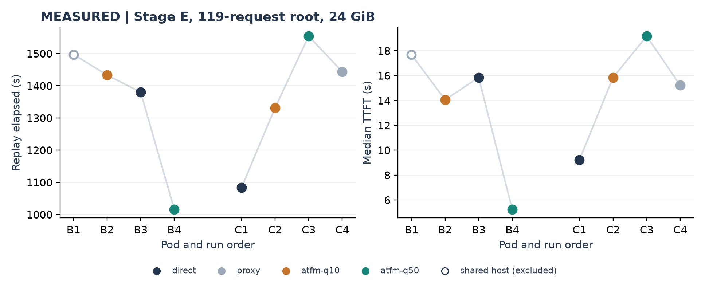

**Figure 14 - Measured stage E replays in run order.** Pod B (US-NE-1) and Pod C (US-MO-1) each ran all four arms once. B1 overlapped another Pod on the same host and is excluded.

| Pod, order, arm | Elapsed | TTFT p50 / p95 | Hit ratio | L1 warnings | Warms: issued; complete / partial |
| --- | --- | --- | --- | --- | --- |
| B2 atfm-q10 | 1,433 s | 14.06 / 35.71 s | 87.3% | 26 | 41; 10 / 24 |
| B3 direct | 1,380 s | 15.83 / 28.85 s | 90.3% | 18 | - |
| B4 atfm-q50 | 1,016 s | 5.24 / 31.01 s | 87.4% | 16 | 34; 7 / 24 |
| C1 direct | 1,083 s | 9.23 / 35.13 s | 87.3% | 22 | - |
| C2 atfm-q10 | 1,331 s | 15.84 / 32.96 s | 85.2% | 32 | 23; 5 / 13 |
| C3 atfm-q50 | 1,554 s | 19.17 / 39.35 s | 84.8% | 51 | 26; 4 / 21 |
| C4 proxy | 1,444 s | 15.21 / 30.93 s | 89.5% | 17 | - |

---PAGE---
# 14 | Stage E: why the result is inconclusive

**Order dominates.** Pod B improved with each run (its last arm, atfm-q50, was best: -26% duration and -67% median TTFT against direct), while Pod C degraded from its first run (direct, best) to its third (atfm-q50, worst: +43%). The same arm therefore ranked best on one Pod and worst on the other. Round 3's bracketed order (48, 24, 24, 48 GiB) had shown 1-3% within-setting spread; a single shuffled order per Pod cannot separate arms from drift. Pod C's host showed a load average of 16-20 from other tenants during the runs, a plausible but unproven source.

**The workload leaves almost no time to warm.** Across every proxied replay the gap between a call's end and the same session's next request was 0.84 / 1.64 / 1.96 s (p10 / p50 / p90); only 2 of 114 gaps exceeded 5 s, one being the parent's 14-23-minute wait for its sub-agents. With about 80k-token contexts needing about 8 s to warm (section 11), warms were issued a median 0.6-0.9 s before the next request and could not finish. Most were partial, most likely because chunks that failed L1 allocation were never stored, which warming cannot recover.

**Consistent signals.** On Pod C both warming arms had lower hit ratios and more allocation warnings than direct, consistent with warm traffic competing for the CPU tier; Pod B did not show this for atfm-q50. The proxy hop's own cost is confounded with order (C4 versus C1) and remains unmeasured.

**What stage E does establish.** The complete forecast-to-cache path - proxy events, held-out survival forecasts, prefetch planning, asynchronous LMCache warms - runs on real GPUs against a real agent replay without errors, issuing warms within about 1 s of a call ending. It also shows which quantity decides whether warming can help: the idle window before a session's next request relative to the warm time measured in stage C. In this replay that window was shorter than the warm for almost every turn.

**What would decide it.** Bracketed arm orders with repeats on each Pod, a workload with multi-second tool phases, and per-warm key accounting (section 23).

---PAGE---
# 15 | Stage E2: a long-gap fleet, bracketed

Stage E's replay left no time to warm. Stage E2 replays a **fleet**: four complete Weka roots chosen for long idle gaps (at least 8 of 19-26 gaps lasting 10 s or more; contexts up to 114k tokens; 100 requests), run concurrently so their contexts share a 24 GiB CPU tier. 43 of 100 requests follow a gap of 10 s or more, against 1 of 119 in stage E. One H100 SXM Pod (AP-IN-1, 28 vCPU, host load average 3-8) ran direct, atfm-q50, atfm-q50, direct, so linear drift cancels [16].

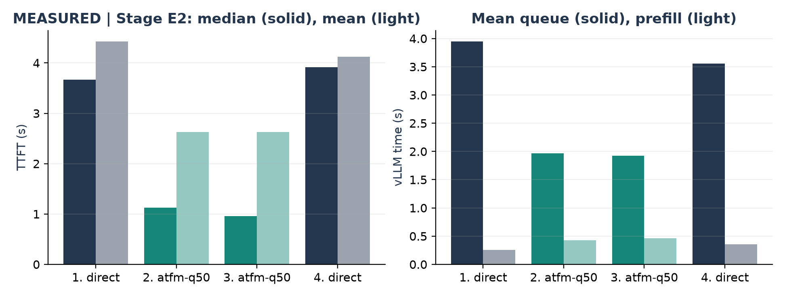

**Figure 15 - Measured stage E2 runs in order.** Left: client TTFT median and mean. Right: mean vLLM queue and prefill time per request from Prometheus counter deltas.

| Run (order) | Elapsed | TTFT p50 / p95 / mean | vLLM queue / prefill (mean) | Hit ratio | Warms complete / partial |
| --- | --- | --- | --- | --- | --- |
| 1 direct | 1,671 s | 3.67 / 11.31 / 4.43 s | 3.95 / 0.26 s | 91.9% | - |
| 2 atfm-q50 | 1,578 s | 1.13 / 8.10 / 2.63 s | 1.97 / 0.42 s | 85.6% | 58 / 3 |
| 3 atfm-q50 | 1,581 s | 0.96 / 8.38 / 2.63 s | 1.92 / 0.47 s | 83.5% | 48 / 1 |
| 4 direct | 1,612 s | 3.92 / 8.19 / 4.12 s | 3.56 / 0.36 s | 88.3% | - |

**Both ATFM runs beat both bracketing direct runs:** median TTFT about 72% lower, mean about 38% lower, duration about 4% lower. Warms landed a median 10.7-13.3 s before the session's next request and 97.5% of expected keys were found, the conditions stage C showed warming needs. The difference sits almost entirely in vLLM queue time; prefill rose slightly and decode was unchanged. Requests after gaps under 2 s, which could not have been warmed themselves, improved as much as those after long gaps (median 3.45-3.69 s against 1.21-1.43 s), consistent with a fleet-wide queueing effect: warming moves other sessions' on-demand loads off the engine's two slots.

**Not yet attributed.** ATFM runs pass through the ATFM proxy and direct runs do not; section 16 separates the two. The hit ratio fell under ATFM while TTFT improved, which remains unexplained.

---PAGE---
# 16 | Stage E3: separating the proxy from warming

Stage E2 compared ATFM (proxy + board + control loop) with direct vLLM, so the proxy hop and forecast-driven warming were confounded. Stage E3 separates them with two bracketed Pods on separate hosts, each comparing one pair:

| Pod | Order | Question |
| --- | --- | --- |
| A (AP-IN-1) | direct, proxy, proxy, direct | Does the ATFM proxy alone change TTFT and queueing? |
| B (US-NE-1) | proxy, atfm-q50, atfm-q50, proxy | What does warming add beyond the proxy? |

Same fleet, 24 GiB CPU tier, training table, calibration and policy as E2.

**Status: stopped early (credits) after the first run on each Pod.** Pod A direct: 100/100, 1,629 s, TTFT p50 4.50 s, mean vLLM queue 4.42 s. Pod B proxy: 100/100, 1,752 s, TTFT p50 9.51 s, queue 8.60 s. These are on different hosts and are **not** a valid comparison; no within-Pod pair finished, so **the proxy-versus-warming attribution of E2 remains open**. Evidence: `results/gpu-stage-e3-2026-10-01/`.

---PAGE---
# 17 | Memory: the first hard constraint

For a conventional uniform, uncompressed attention KV layout, tensor bytes per token are `b = 2 x layers x KV_heads x head_dimension x bytes_per_element`. The factor two represents keys and values. For this run, LMCache directly reports `b = 147,456 bytes = 144 KiB`. The calculations below use that observed value rather than assuming all models have this footprint [4].

For independent resident token sets, `M_KV = b x U`, where U is the number of unique cached token positions. Add metadata, alignment, allocator overhead, in-flight buffers, and other processes when sizing the host. GiB means 2^30 bytes.

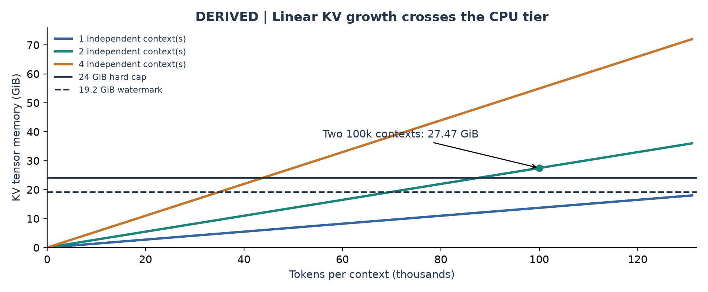

**Figure 5 - Derived tensor demand.** Lines assume independent contexts, no shared-prefix savings, and the measured 4B model layout. Crossings show capacity pressure, not a prediction of request failure. Eviction begins before the hard cap.

| Scenario | KV tensors alone | Consequence |
| --- | --- | --- |
| 100,000 tokens, one context | 13.73 GiB | Fits below 19.2 GiB watermark in isolation |
| 100,000 tokens, two independent contexts | 27.47 GiB | Exceeds the configured 24 GiB L1 |
| 131,072 tokens, one context | 18.00 GiB | Little room below watermark for other objects |
| 24 GiB hard-cap token equivalent | About 174,763 tokens | Idealized total, excluding overhead |
| 19.2 GiB watermark equivalent | About 139,810 tokens | Eviction trigger, not a separate hard limit |

Round 3 confirmed the prediction: on the 119-request root the 24 GiB tier logged 18-32 batch-allocation failures per run and a 1.9x longer replay than 48 GiB (section 09). More GPU VRAM does not automatically enlarge CPU L1. Likewise, a 55% GPU utilization setting is a memory-budget parameter, not measured GPU utilization or a CPU-cache limit. Engine max sequences bounds active engine work; retained historical prefixes and prefetch batches can create a larger CPU working set.

---PAGE---
# 18 | Concurrency, sharing, and headroom

The relevant size is the union of resident cached objects, not simply active sessions multiplied by their full text lengths. Shared prefixes can reduce unique storage if the engine and cache identity permit deduplication. Branch suffixes, multiple models, and incompatible layouts can remove that advantage. These examples are sizing scenarios, not measured deduplication rates.

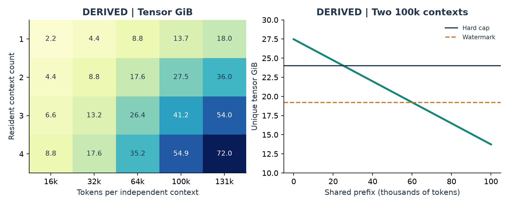

**Figure 6 - Derived scenario analysis.** Left: KV GiB versus independent context count and length. Right: two 100k-token contexts sharing P initial tokens require `b x (200k - P)` bytes, assuming each shared object is stored once in L1. The dashed line is the 19.2 GiB watermark.

### Quantifying the headroom problem

For two 100k-token contexts, sharing more than approximately 25,237 tokens brings tensors below 24 GiB. Sharing more than approximately 60,190 tokens brings them below 19.2 GiB. Neither threshold includes metadata, unrelated cache objects, or temporary allocations. They are optimistic boundaries, not recommended operating targets.

A planning constraint is `resident_bytes + in_flight_bytes + reserved_headroom <= L1_capacity`. If the implementation counts in-flight reservations inside resident allocation, avoid double-counting them. Measure allocator state and locked bytes explicitly; do not infer free allocatable space from an end-of-run object count.

### Why more capacity is a diagnostic experiment

Moving from 24 to 48 GiB was expected to reduce capacity pressure but not guaranteed to reduce latency. Measured on this root, it did both: warnings fell to zero, the hit ratio rose from 89.5% to 95.9%, and median TTFT fell 5.7x on the H100 SXM (section 09). Other roots, models or concurrency levels can still be limited by transfer bandwidth, prefill, decode, or the client. A 64 GiB tier offers additional headroom but consumes host RAM needed for the OS, engine, staging, and other processes. Check actual available/pinnable RAM before increasing reservations.

The useful question is not whether every historical context fits forever. It is whether contexts needed soon can remain available without displacing more valuable ones or saturating the transfer path.

---PAGE---
# 19 | Chunk size: objects versus granularity

The public runs use 16-token chunks. At 144 KiB per token, each full chunk contains 2.25 MiB of KV tensors. A 100k-token context therefore involves 6,250 chunks. Larger chunks reduce the number of objects and operations, but each allocation and transfer becomes larger. This tradeoff does not make total tensor bytes disappear.

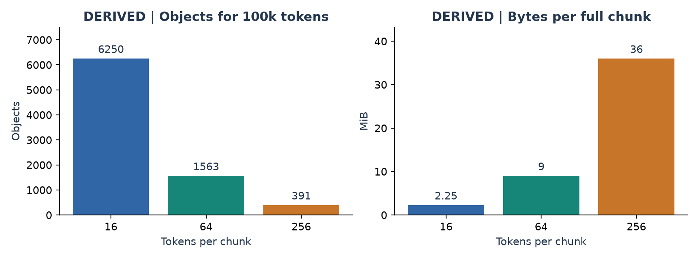

**Figure 7 - Derived chunk sizing for 100,000 tokens.** Object counts use `ceil(tokens / chunk_size)` as a capacity model. A last partial chunk may instead be omitted from reuse by a particular implementation. Actual behavior must be checked on the pinned connector.

| Chunk tokens | Objects for 100k | Full chunk size | Max rounded tail per context |
| --- | --- | --- | --- |
| 16 | 6,250 | 2.25 MiB | Less than 2.25 MiB |
| 64 | 1,563 | 9 MiB | Less than 9 MiB |
| 256 | 391 | 36 MiB | Less than 36 MiB |

### Expected benefits and costs

Larger chunks can amortize per-object hashing, metadata, queue dispatch, and filesystem operations. They also coarsen prefix reuse and eviction boundaries, enlarge reservation bursts, and may transfer bytes that are not subsequently useful. Smaller chunks allow finer retention and cancellation boundaries but can amplify fixed overhead at long contexts.

A simple work model is `T = bytes / effective_bandwidth + object_count x fixed_cost + queue_time`. For fixed chunk size, object count and tensor movement grow linearly with context length. Metadata overhead can be reduced without changing the unavoidable amount of KV data needed by a request.

LMCache's upstream documentation discusses configurable chunks and persistent-tier behavior [8, 9]. Supported sizes, alignment, partial-chunk handling, and batched allocation behavior must be verified against our pinned 0.5.5 stack. Test 16, 64, and 256 separately after capacity is held constant; do not change chunk size and L1 size together and attribute the result to one factor.

---PAGE---
# 20 | Moving KV versus recomputing it

An external-cache hit is not free. The relevant comparison is the wall-clock critical path for retrieving cached KV versus recomputing the same prefix. CPU warming can move L2 reads into an idle interval, but the supported actuator does not promise that data is already resident on the GPU.

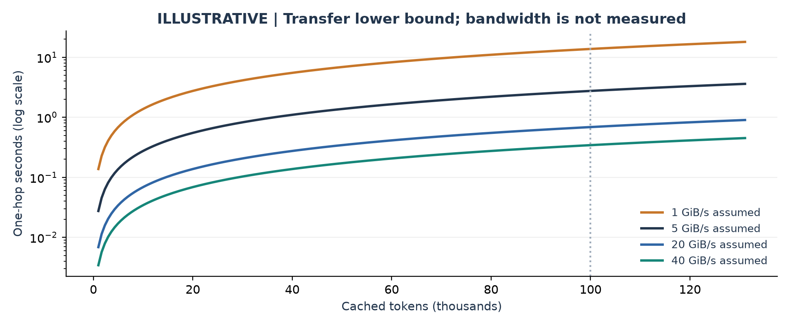

**Figure 8 - Illustrative one-hop transfer lower bounds.** Each line is `time = KV_bytes / effective_bandwidth` for the measured 144 KiB/token layout. Bandwidth values are hypothetical sustained rates in GiB/s, not measurements or specifications of the rented Pod. The log scale shows the sensitivity across storage and host-transfer regimes.

For 100k tokens (13.73 GiB), a single hop takes at least 13.73 s at 1 GiB/s, 2.75 s at 5 GiB/s, 0.69 s at 20 GiB/s, or 0.34 s at 40 GiB/s. These bounds exclude lookup, allocation, dispatch, synchronization, and contention. Two serial hops add; overlapped pipelines approach the slower stage plus fill/drain overhead. Shared bandwidth limits concurrent transfers.

### Break-even test

Define `T_recompute` as measured remaining prefill time without the reusable KV, and `T_retrieve` as retrieval plus exposed synchronization on the critical path. Retrieval helps that request when `T_retrieve < T_recompute`, subject to effects on other requests. Stage C measured both sides (section 11): on-demand L2 retrieval ran at about 1.0-1.3 GiB/s on both hosts from 8k tokens up, beating recompute only for long contexts on the slower A100, while a context already warmed into L1 beat recompute at every length.

Dense-attention prefill has a quadratic attention-work term in context length, while KV size and byte transfer grow linearly. Decode attends over the existing context for each new token. These asymptotic statements do not supply a numerical break-even: kernels, batching, model dimensions, precision, and bandwidth determine constants. Efficient attention implementations need not materialize a quadratic-size score matrix.

Python micro-optimization cannot remove a tens-of-GiB working set. Equally, this evidence does not rule out CPU overhead: thousands of chunks and observed event-loop delays justify profiling. Measure per-object CPU cost and critical-path waits before considering a native-language rewrite.

---PAGE---
# 21 | Predictive warming: timing matters

ATFM's potential value is to use an agent's tool-running interval to load context before the next LLM request. A useful prediction needs both the right context and the right time. Loading too late exposes transfer delay; loading too early ties up capacity and risks eviction before use.

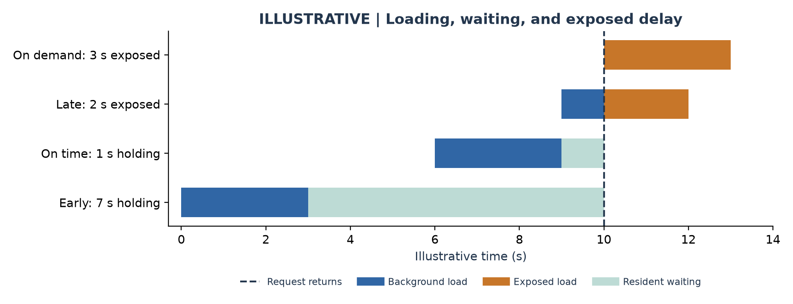

**Figure 9 - Illustrative timing only.** Assume a request returns at t=10 s and L2-to-L1 loading takes 3 s. An on-demand load exposes all 3 s; a load ending at t=12 exposes 2 s; one ending at t=9 hides that stage with a 1 s residency wait. A load ending at t=3 holds memory for 7 s and might be evicted. GPU transfer and inference are omitted and still have to occur.

### A decision rule to test, not a proven optimum

Let p be the probability of reuse before eviction, S the request latency saved if the warm data is useful, D the expected displacement penalty to other requests, and C the transfer/contention cost. In a common objective unit, an action is attractive when `p x S > C + D`. Memory and bandwidth budgets remain hard constraints, even if this expected gain is positive. Costs can be expressed as latency penalties or explicit weighted resource prices, but unlike units must not be added directly.

A practical controller should bound pending jobs, reserve room for demand reads, prioritize likely near-term returns, and track completed useful bytes rather than accepted API calls. Calibration and timeliness matter: an accurate eventual-return prediction can still warm too soon. Completion must be followed by a check that data remained available until demand.

Stage C measured the timing inputs this rule needs (warm time 0.25-9.8 s from 2k to 98k tokens) and stage E tests a forecast-driven controller built on them (sections 11-14). The selected roots lack tool-type signals, so forecasts come from elapsed gap time alone. A policy comparison must include failed/wasted prefetches, eviction of useful data, background bandwidth consumption, and overhead from observation and control.

---PAGE---
# 22 | Design choices and their tradeoffs

There is no hardware-independent best configuration. Separate capacity feasibility, transfer efficiency, and prediction quality so that one cannot hide a weakness in another.

| Choice | Potential value | Cost / risk | What to measure |
| --- | --- | --- | --- |
| Increase L1 to 48 or 64 GiB | Fewer evictions and failed batch reservations | More pinned/host RAM; may not improve the critical path | Peak allocated/locked bytes; warnings; TTFT |
| Bound L2, reserve evidence space | Avoid quota failures; keep durable diagnostics | More L2 evictions and possible recompute | Actual volume bytes; write errors; recoverability |
| Use faster/local L2 | Shorter cold external-cache reads | Rental/storage cost; topology changes | Cold-read bandwidth and p95; OS-cache state |
| Enlarge chunks | Fewer objects, operations, and file accesses | Coarser reuse/eviction; larger bursts | CPU time/object; throughput; useful bytes |
| Batch and pipeline loads | Amortize overhead; overlap transfer stages | More in-flight memory; demand interference | Stage overlap; reservation peaks; tail latency |
| Reduce concurrent active contexts | Keep working set within capacity | More admission queueing and lower possible throughput | End-to-end latency including queue; completions/s |
| Predictive CPU warming | Hide L2 read time during tool waits | Wrong/early loads; displacement; shared bandwidth | Useful-on-time prefetch rate; net latency benefit |
| KV compression / lower precision | Fewer bytes to retain and move | Conversion cost; compatibility and quality concerns | Quality parity; conversion time; net bytes/time |
| CUDA graphs / engine tuning | Lower execution overhead | Different memory budget and compatibility constraints | Controlled eager-versus-graph comparison |

### What seems highest value now

The 29 September ordering has been followed: the large root finishes (round 2), CPU capacity was varied with everything else fixed (rounds 2-3), read/transfer/prefill costs were isolated (stage C), chunking was measured (rounds 2-3), and the predictive controller was compared on matched hardware (stage E). On this workload capacity is the dominant baseline cost, 64-token chunks are a cheap improvement, and warming only pays when it lands ahead of the request.

A better policy cannot keep 27.47 GiB of independent tensors simultaneously inside 24 GiB. It can choose which bytes to keep, when to load them, and which requests to admit. Quantization, sharing, compression, or more capacity change the physical footprint; scheduling changes when that footprint is needed.

---PAGE---
# 23 | The next experiment, designed to decide

Use the same complete 119-request root, fixed reconstruction seed, model revision, and delays. Keep the measurement horizon long enough for the full root, or predeclare a fixed observation window and explicitly change the claim. Do not rescue a result by silently truncating the workload.

| Stage | Controlled comparison | Status (30 Sep) |
| --- | --- | --- |
| A: valid baseline | Fresh cache; 24 GiB; sufficient L2/evidence quota | Done: completes in every replay (round 2 onward) |
| B: capacity | 24 vs 48 GiB | Done: 1.9x duration, 5.7x median TTFT (section 09) |
| C: retrieval path | Cold recompute; L2 present/L1 empty; verified warm L1 | Done: warmed L1 wins at every length (section 11) |
| D: granularity | 16 vs 64 vs 256 tokens at fixed L1 | Done: 64/256 lower TTFT 9-17% (section 10) |
| E: policy | Ordinary LMCache; proxy only; forecast-driven warming | E inconclusive; E2 positive, pending proxy control (sections 13-16) |

**Next.** Stage E2 adopted bracketed orders, a long-gap fleet, per-warm key accounting and host load; stage E3 separates the proxy. Remaining: more fleet compositions and Pods, per-request queue tracing, and runs at 48 GiB with 64-token chunks, the better baseline.

### Instrument the critical path

Align per-request timestamps for client send, queue admission, lookup, L2 read, allocation waits, CPU-to-GPU copy, prefill, first token and completion, with bytes and object counts. Stage durations overlap: report exposed waits, not an unqualified sum.

Sample allocated/reserved/locked L1, in-flight bytes, evictions, load failures, L2 footprint, demand versus speculative traffic, and exact filesystem quota. A warm filesystem page cache is not a cold disk read; predeclare how that state is controlled. Retain logs on capacity-reserved storage.

### Acceptance and comparison rules

Require all expected requests and child branches, full output targets, complete exports and no quota errors. Bracket conditions within a Pod (A-B-B-A) and repeat; three repetitions are a feasibility floor, not a precision guarantee. Use paired whole-run comparisons and intervals that respect correlated requests; do not treat every token as an independent sample.

Choose primary outcomes before running: complete-session duration, request TTFT distribution, and end-to-end latency including holds. Report useful/wasted prefetch bytes and hardware cost alongside latency. Validate any selected configuration on held-out roots. An offline clairvoyant policy may provide a bound only if it obeys the same capacities and transfer costs and is clearly labeled as using future information.

---PAGE---
# 24 | Reproducibility and fixes

The archived artifacts are the authority for experiment claims. This PDF adds analysis and visualizations; it does not replace the raw records. Sources [1-4] link exact configurations, command lines, request exports, counters, source fingerprints, and checksums.

| Revision | Role |
| --- | --- |
| 3df2d53 | Passing H100 compatibility check |
| 676bb9f | First full short-root run; reconstruction seed not yet pinned |
| 4bcc012 | Accepted seeded short + sequential results; handler fix |
| 1c33fa7 | Expanded 40-case BFCL-derived tool matrix |
| f441de1 | Isolated selected-root retry with regression coverage |
| 739f902 | Final retained stress outcome and shutdown documentation |
| e1c20b3, 18645ff | Round 2: replay options (L1, chunk, limits), Pod round scripts, TIME_WAIT fix |
| d694c18 | Round 3: seeded plan files; stop watchdog reads Runpod IDs from PID 1 |
| 0552406 | Stage C retrieval-path benchmark |
| 45bbf93 | Stage E: PrefetchPlanner, gap phase, asynchronous warms, held-out training, replay arms |

The session stop condition was changed from request count to one complete root. The replay seed was pinned to 7. Result handling regained its expected-count argument. Tool-check failures now affect the overall verdict. A selected-case option allows an isolated root without repeating earlier cases. These runner changes leave core ATFM policy logic unchanged.

Regression validation recorded with the 29 September experiments was **603 passed, 3 skipped**; at `45bbf93` it was **655 passed, 3 skipped**. Generating this report does not itself run GPU experiments or the test suite.

---PAGE---
# 25 | Rental accounting and retained data

### Rental outcome

| Round | GPUs | Estimated compute |
| --- | --- | --- |
| 29 Sep first trial | 2 H100 NVL windows, 117.4 min | $6.24 |
| Round 2 | H100 SXM x2 (one idle 6 min), A100 | about $5.8 |
| Round 3 | H100 SXM, A100, RTX PRO 6000 | about $7.3 |
| Stage C | H100 SXM, A100 (about 15 min each) | about $1.3 |
| Stage E | 3 H100 SXM (one replaced after sharing a host) | about $13.8 |

Estimates use created-to-terminated windows at quoted rates. Runpod's billing API reported $30.79 for 29-30 September (GPU $29.29, disk $1.50) when read at about 06:45 UTC; it may not yet include the final minutes. Every Pod was terminated and the account had no Pods afterwards; the two stopped 29 September Pods were deleted on 30 September.

**29 September (first trial).** 
Both Pods were confirmed EXITED. The original allocation ran from 02:36:41.930 to 03:26:25 UTC; the replacement from 03:40:16.821 until stop was confirmed by 04:47:58 UTC on 29 September. Created-to-confirmed-stop windows total 7,044.249 seconds, or 117.4 minutes, below the approved aggregate 120 minutes.

At the quoted $3.19/hour, that is approximately $6.24 compute. This is an estimate, not an invoice; storage, tax, and provider billing adjustments are excluded. Both persistent volumes remained allocated and chargeable at the last recorded check. The original Pod's restart failed because its host had no free GPU.

### Retained versus excluded data

Rounds 2, 3 and stages C and E keep per-step archives (AIPerf exports, before/after counters, server logs, manifests; bulk KV excluded), step logs, plan files and SHA-256 indexes under `docs/research/results/` [11-15]. 
Three public-workload archives include the invalid attempts, complete seeded cases, tool matrix, and isolated retry. Their local hashes matched remote copies before shutdown. Model weights and bulk KV tensor files are excluded. The repository retains 24 checksummed curated files in the public H100 evidence bundle, plus separate local/H100 compatibility evidence. Null-filled tails from the quota failure remain original evidence, not silently repaired data.

---PAGE---
# 26 | Sources and evidence index

Links [1-9] refer to the committed 29 September record at `739f902`; [10-15] refer to the main branch. Live upstream documentation was consulted on 29 September 2026 for conceptual interpretation; it can describe capabilities newer than the pinned runtime. It is not evidence that a feature was enabled in these runs.

[1] [Public GPU workloads: detailed measured report](https://github.com/Alexander-Aghili/ATFM/blob/739f902/docs/research/2026-09-29-public-gpu-workloads.md). Accepted sessions, incomplete attempts, diagnostics, and shutdown.

[2] [H100 compatibility report](https://github.com/Alexander-Aghili/ATFM/blob/739f902/docs/research/2026-09-29-h100-cache.md). Native build fixes and completed warming/reuse.

[3] [Local RTX 4060 compatibility report](https://github.com/Alexander-Aghili/ATFM/blob/739f902/docs/research/2026-09-28-gpu-cache.md). Fresh and rebuilt environment runs, actuator scope, limitations.

[4] [Public H100 evidence bundle](https://github.com/Alexander-Aghili/ATFM/tree/739f902/docs/research/results/gpu-public-h100-2026-09-29) and [reproduction guide](https://github.com/Alexander-Aghili/ATFM/blob/739f902/docs/development/gpu-public-workloads.md). Machine-readable profiles, manifests, tool responses, retry records, full archives, and SHA-256 index.

[5] [SemiAnalysis Weka trace corpus](https://huggingface.co/datasets/semianalysisai/cc-traces-weka-062126). Exact selected root IDs and hashes are in the evidence bundle's `selection.json`; the source file SHA-256 is `29b6a19e751ff5230771519aab755f80a0f43a4ba9cf96b72d3a6a437ec99276`.

[6] [BFCL pinned dataset tree](https://github.com/ShishirPatil/gorilla/tree/58f57e9124ea981403792dd51e00a6577e621fae/berkeley-function-call-leaderboard/bfcl_eval/data). Four V4 categories; first ten rows each. Saved `parallel_9-reference.json` preserves the expected two-call reference and its source hash.

[7] [vLLM automatic prefix caching](https://docs.vllm.ai/en/v0.15.0/features/automatic_prefix_caching/). Conceptual distinction between reused prefill and new-token decoding; this documentation version is not the serving version used in the experiment.

[8] [LMCache MP configuration](https://docs.lmcache.ai/mp/configuration.html). Reference for configurable chunks, memory managers, and bounded in-flight prefetch concepts. Verify supported settings against the pinned release.

[9] [LMCache persistent L2 storage](https://docs.lmcache.ai/mp/l2_storage.html). Storage-tier and eviction concepts; no upstream benchmark numbers are imported here.

[10] [ATFM research index](https://github.com/Alexander-Aghili/ATFM/blob/main/docs/research/README.md). Earlier CPU, forecasting, simulation, and local service results, intentionally kept distinct from this real-GPU campaign.

[11] [GPU round 2](https://github.com/Alexander-Aghili/ATFM/blob/main/docs/research/2026-09-29-gpu-round2.md) and its [evidence](https://github.com/Alexander-Aghili/ATFM/tree/main/docs/research/results/gpu-round2-2026-09-29). First complete large root, CPU-tier pair, A100 repeats, chunk size.

[12] [GPU round 3](https://github.com/Alexander-Aghili/ATFM/blob/main/docs/research/2026-09-30-gpu-round3.md) and its [evidence](https://github.com/Alexander-Aghili/ATFM/tree/main/docs/research/results/gpu-round3-2026-09-30). Seeded random capacity and chunk repeats; Blackwell.

[13] [Retrieval paths (stage C)](https://github.com/Alexander-Aghili/ATFM/blob/main/docs/research/2026-09-30-retrieval-paths.md) and its [evidence](https://github.com/Alexander-Aghili/ATFM/tree/main/docs/research/results/gpu-retrieval-2026-09-30).

[14] [Stage E design](https://github.com/Alexander-Aghili/ATFM/blob/main/docs/superpowers/specs/2026-09-30-stage-e-design.md) and [runbook](https://github.com/Alexander-Aghili/ATFM/blob/main/docs/development/gpu-public-workloads.md).

[16] [Stage E2 note](https://github.com/Alexander-Aghili/ATFM/blob/main/docs/research/2026-10-01-stage-e2.md) and [evidence](https://github.com/Alexander-Aghili/ATFM/tree/main/docs/research/results/gpu-stage-e2-2026-10-01): bracketed runs, TTFT by preceding gap, per-warm keys, engine phase means.

[15] [Stage E evidence](https://github.com/Alexander-Aghili/ATFM/tree/main/docs/research/results/gpu-stage-e-2026-09-30) and [note](https://github.com/Alexander-Aghili/ATFM/blob/main/docs/research/2026-09-30-stage-e.md): per-arm summaries, gap analysis, archives, plans and SHA-256 index.

Archive fingerprints for every round are in each evidence directory's `sha256.json`. All figures in this report are generated from retained observations or explicitly labeled calculations. No figure represents an unperformed policy trial.
